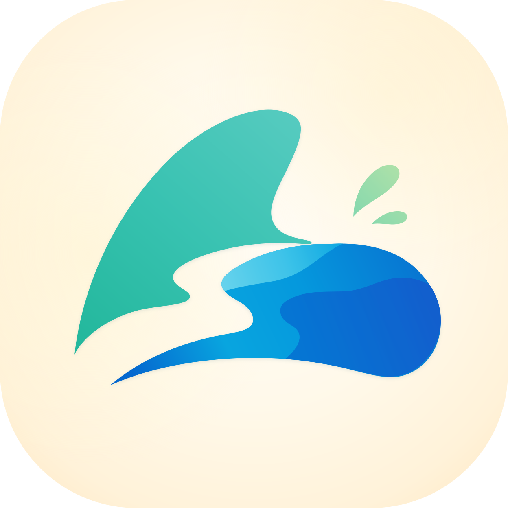
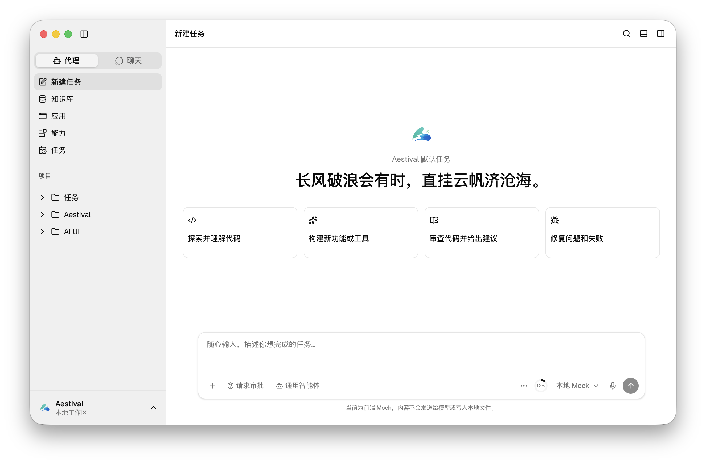
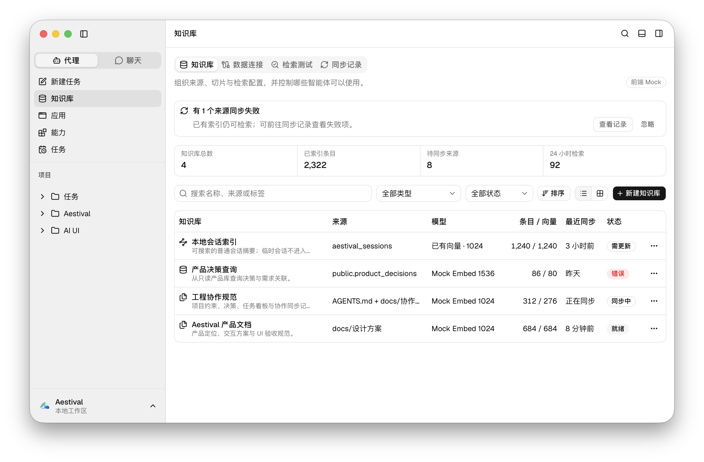

<p align="center">
  
</p>

<h1 align="center">Aestival</h1>

<p align="center">
  本地优先、无登录流程的跨平台 AI Agent 桌面工作区
</p>

<p align="center">
  在同一个窗口中组织项目、会话、代理任务、知识库与开发工具。
</p>

> [!IMPORTANT]
> Aestival 正在开发中。当前仓库以桌面应用外壳、前端 UI 和 Mock 交互为主，尚未接入真实模型调用、数据库、向量检索、MCP、Skill、终端、文件系统、定时任务执行或外部消息平台服务。





## 🌊 Aestival 是什么

Aestival 面向需要长期使用 AI Agent 处理项目任务的桌面场景。它将代理对话、项目上下文、文件浏览、终端、搜索、日志和会话调试放在统一工作区内，并通过明确的权限与状态反馈展示代理执行过程。

产品设计遵循以下原则：

* 本地优先，不提供 Aestival 账户、登录或注册流程
* 启动后可以快速创建任务或继续已有会话
* 代理执行过程可观察、可授权、可停止、可恢复
* 项目、会话、文件、知识库与工具状态具有明确归属
* 代理模式与聊天模式共用会话界面，聊天模式禁用工具和副作用能力
* 默认使用双栏布局，按需展开右侧检查器和底部工作区面板

## ✨ 当前进度

| 模块      | 当前状态                                      |
| ------- | ----------------------------------------- |
| 桌面应用外壳  | 已实现并完成基础验证                                |
| 新建任务首页  | 已实现 Mock 交互                               |
| 代理与聊天   | 已实现消息流、审批、停止、重试与工具调用 Mock                 |
| 输入区增强   | 已实现附件、Slash Command、模式选择、模型与智能体选择 Mock    |
| 多模型与上下文 | 已实现多模型比较、会话统计、上下文压缩与分叉 Mock               |
| 会话管理    | 已实现项目、会话、归档、Star、搜索、移动、删除与临时会话 Mock       |
| AI 代码预览 | 已实现 HTML、CSS、JavaScript 预览、权限确认与应用草稿 Mock |
| 知识库     | 已实现知识库、数据连接、检索测试、同步记录与向导 Mock             |
| 应用中心    | 页面骨架与局部草稿能力，完整管理界面仍在开发                    |
| 能力中心    | 页面骨架，MCP、Skill、智能体、指令与 Hooks 尚未接入         |
| 工作区面板   | 设计已完成，文件、终端、搜索、日志与会话调试仍待实现                |
| 后端业务服务  | 尚未接入                                      |

最新实施状态见 [`docs/协作同步/当前状态.md`](./docs/协作同步/当前状态.md)。

## 🧭 规划能力

### 代理与聊天

* 流式输出、思考大纲和工具调用过程
* 图片、文档和语音输入
* 模型、智能体和权限策略选择
* 多模型并行对话与结果比较
* 记忆、知识库检索、网络搜索和工作流触发
* Token、费用与跨计费段统计
* 上下文压缩、会话分叉和临时会话
* Markdown、HTML、PDF、Word 导出

### 知识库

* 文件知识库
* PostgreSQL、MySQL、Oracle
* Milvus、Weaviate、Chroma
* Elasticsearch、Redis
* 向量检索与关系数据检索
* 数据连接、索引、同步和检索调试

### 应用中心

* 创建和管理 HTML、CSS、JavaScript 小应用
* 从 AI 生成代码创建应用
* 代码编辑、权限预览和运行配置
* 使用 Wails 多窗口能力在独立窗口运行应用

### 能力中心

* MCP 管理与市场
* Skill 创建、导入、安装与市场
* 自定义智能体
* 可注入指令
* Session、Prompt、Tool、Compact 等阶段的 Hooks

### 桌面工作区

* 文件树与文件图标映射
* Monaco Editor 代码查看与编辑
* 常见二进制文件预览
* 多实例终端
* 文件内容搜索
* 日志和会话调试

### 自动化与连接

* 定时任务和 Cron 表达式
* Telegram、飞书、Discord、钉钉、微信、QQ 等外部连接
* 配对、允许列表、群聊提及和最小权限控制
* 通知、快捷键、主题和使用统计

## 🧱 技术栈

| 领域    | 技术                                  |
| ----- | ----------------------------------- |
| 桌面运行时 | Wails 3                             |
| 后端    | Go 1.25                             |
| 前端    | React 19、TypeScript、Vite 6          |
| 样式    | Tailwind CSS 4、shadcn/ui、Base UI    |
| 状态管理  | Zustand                             |
| 图标    | Lucide React、Material Icon Theme 资源 |
| 布局    | react-resizable-panels              |
| 命令与搜索 | cmdk                                |
| 通知    | Sonner                              |
| 图表    | Recharts                            |
| 主题    | next-themes                         |

Wails 3 当前仍处于 Alpha 阶段，项目依赖版本可能随上游更新发生变化。

## 📦 环境要求

* Go 1.25 或更高版本
* Node.js 20.18.1 或更高版本
* npm
* Wails 3 CLI
* 对应平台的编译工具与 WebView 依赖

安装 Wails 3 CLI：

```bash
go install github.com/wailsapp/wails/v3/cmd/wails3@latest
```

检查本机开发环境：

```bash
wails3 doctor
```

## 🚀 本地开发

```bash
git clone https://github.com/coolerks/aestival.git
cd aestival

npm --prefix frontend install
wails3 dev
```

开发模式默认通过 Vite 提供前端热更新，并由 Wails 启动桌面窗口。

仅启动前端：

```bash
npm --prefix frontend run dev
```

## 🏗️ 构建与打包

构建当前平台的生产版本：

```bash
wails3 build
```

生成当前平台的安装包或应用包：

```bash
wails3 package
```

构建产物默认写入 `bin/` 目录。macOS 打包产物为 `bin/aestival.app`。

前端生产构建：

```bash
npm --prefix frontend run build
```

常用验证命令：

```bash
npm --prefix frontend run build
go test ./...
go vet ./...
wails3 package
```

## 🗂️ 项目结构

```text
aestival/
├── frontend/
│   ├── src/
│   │   ├── assets/icons/       # 应用与文件图标
│   │   ├── components/         # 页面与交互组件
│   │   ├── data/               # 前端 Mock 数据
│   │   └── store/              # Zustand 状态
│   └── package.json
├── docs/
│   ├── 设计.md                 # 产品功能设计
│   ├── 设计方案/               # UI、交互、状态与验收基线
│   ├── 协作同步/               # 状态、任务、决策与变更记录
│   └── 文件图标映射.md
├── build/                       # 各平台构建与打包配置
├── main.go                      # Wails 应用入口与主窗口配置
├── go.mod
├── Taskfile.yml
└── AGENTS.md                    # 项目协作规则
```

## 🎨 图标资源

| 用途          | 文件                                                        |
| ----------- | --------------------------------------------------------- |
| 应用主图标       | `frontend/src/assets/icons/application/logo.svg`          |
| 状态栏与任务栏模板图标 | `frontend/src/assets/icons/application/icon-template.svg` |
| 应用内品牌图标     | `frontend/src/assets/icons/application/icon.svg`          |
| 文件和文件夹图标    | `frontend/src/assets/icons/material/`                     |
| 文件图标映射规则    | `docs/文件图标映射.md`                                          |

文件图标资源使用 [Material Icon Theme](https://github.com/material-extensions/vscode-material-icon-theme)。

## 📚 设计文档

* [`docs/设计.md`](./docs/设计.md)：产品定位与完整功能清单
* [`docs/设计方案/README.md`](./docs/设计方案/README.md)：UI 设计基线与文档导航
* [`docs/设计方案/01-视觉系统与窗口布局.md`](./docs/设计方案/01-视觉系统与窗口布局.md)：视觉语言与窗口结构
* [`docs/设计方案/04-代理与聊天.md`](./docs/设计方案/04-代理与聊天.md)：代理、聊天与消息交互
* [`docs/设计方案/05-知识库与全局搜索.md`](./docs/设计方案/05-知识库与全局搜索.md)：知识库与检索体验
* [`docs/设计方案/07-能力中心.md`](./docs/设计方案/07-能力中心.md)：MCP、Skill、智能体、指令与 Hooks
* [`docs/设计方案/09-工作区面板与文件预览.md`](./docs/设计方案/09-工作区面板与文件预览.md)：文件、终端、日志与调试面板
* [`docs/设计方案/11-状态模型与验收标准.md`](./docs/设计方案/11-状态模型与验收标准.md)：状态模型与验收标准

## 🤝 参与开发

开始修改前，请阅读：

1. [`AGENTS.md`](./AGENTS.md)
2. [`docs/协作同步/README.md`](./docs/协作同步/README.md)
3. [`docs/协作同步/当前状态.md`](./docs/协作同步/当前状态.md)
4. [`docs/协作同步/任务看板.md`](./docs/协作同步/任务看板.md)
5. [`docs/协作同步/决策记录.md`](./docs/协作同步/决策记录.md)

界面实现需要遵守项目设计基线：

* 页面名称只显示在全局标题栏
* 全局使用自定义 ContextMenu，禁用浏览器原生右键菜单
* 优先使用 shadcn/ui 已有组件
* Card 仅用于边界独立的对象，禁止 Card 嵌套
* 破坏性操作使用 AlertDialog
* 菜单项需要图标，存在快捷键时在右侧展示
* 管理页面需要覆盖空、加载、错误和成功状态

## ⚠️ 已知限制

* 当前数据主要保存在前端内存状态中，刷新或重启后不会持久化
* 密码、Token 和数据库凭据不会被当前 Mock 界面保存
* 知识库、数据连接和检索页面尚未连接真实服务
* 应用、能力和任务页面仍有较多功能处于设计或骨架阶段
* 前端主 Bundle 仍有体积提示，重型页面正在按需拆分
* Wails 3 Alpha 和相关前端依赖仍可能出现破坏性更新

## 📄 许可证

本项目采用 [MIT](./LICENSE) 许可证。 