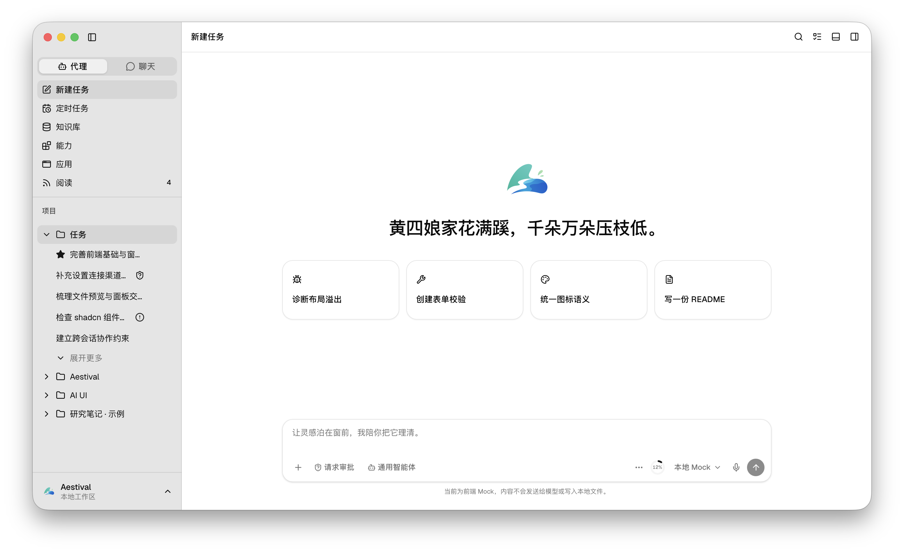
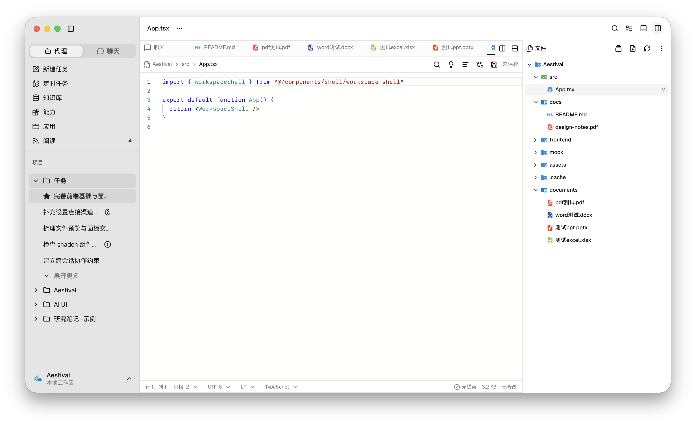
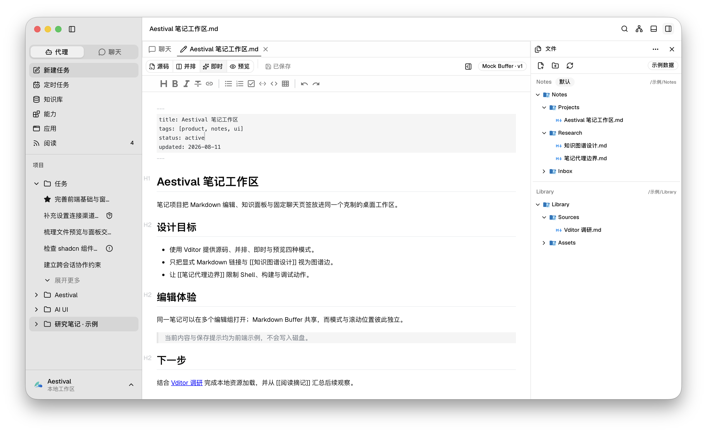
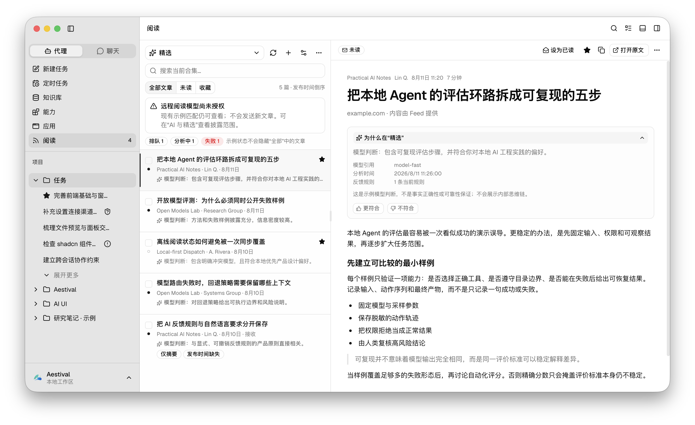
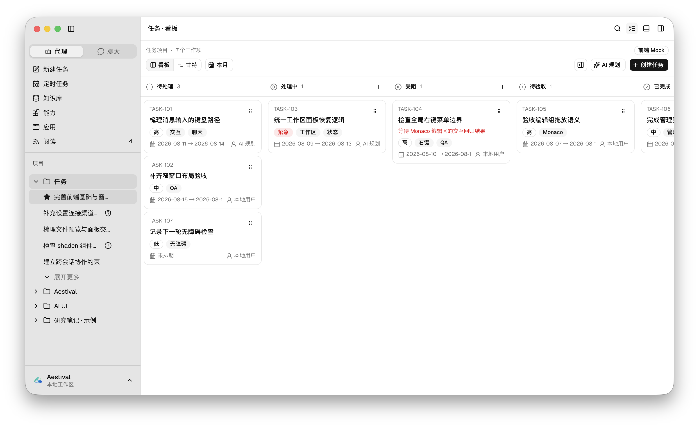
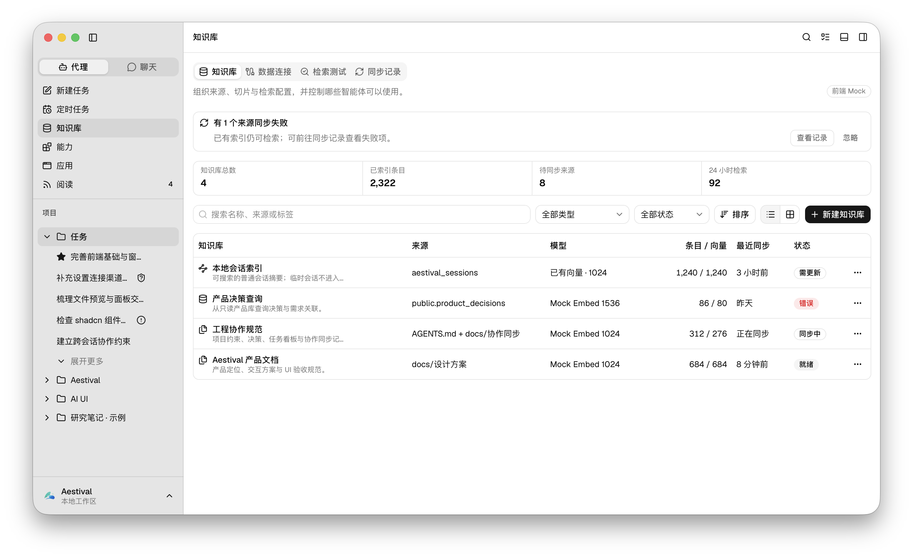
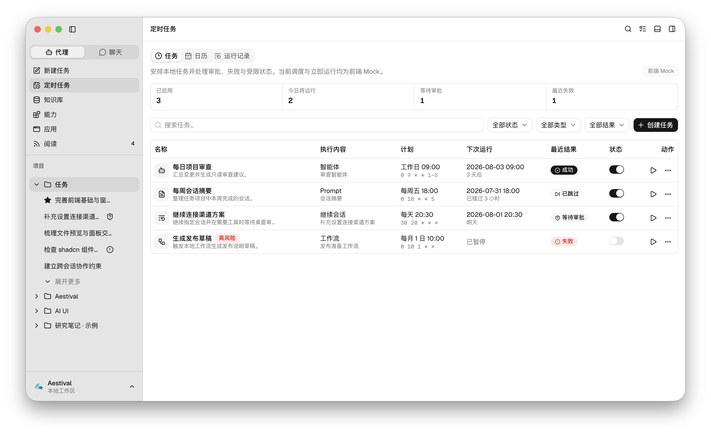
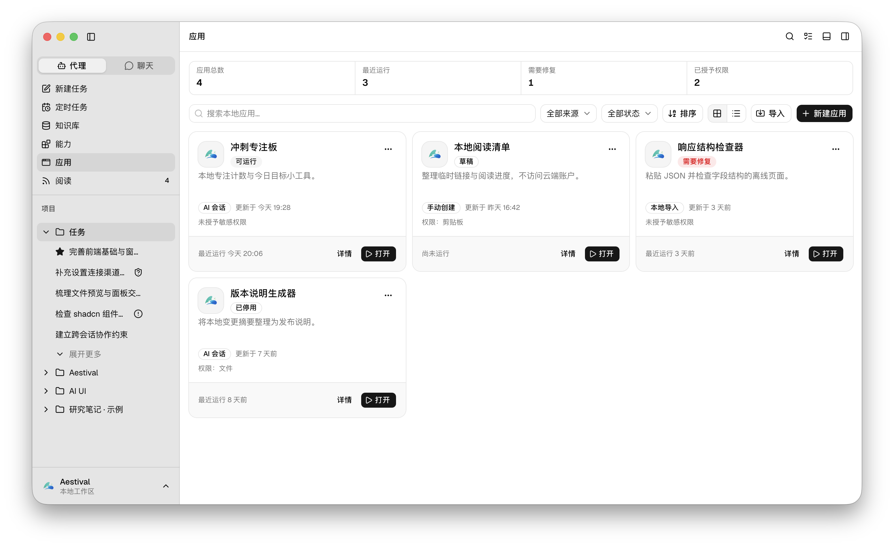
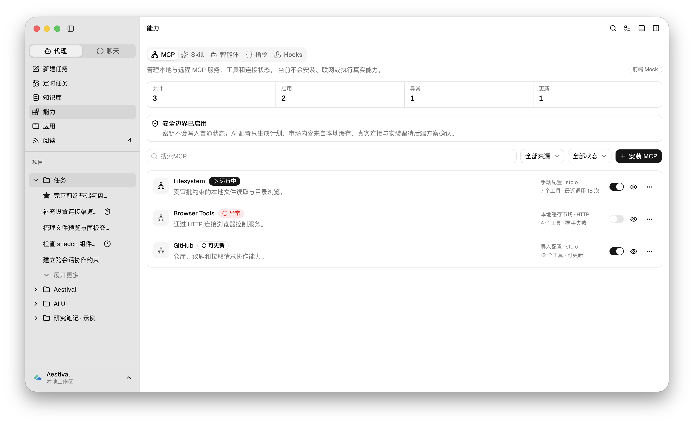

<p align="center">
  
</p>

<h1 align="center">Aestival</h1>

<p align="center">
  本地优先、无账户体系的跨平台 AI Agent 桌面工作区
</p>

<p align="center">
  在一个窗口中组织代理会话、项目文件、Markdown 笔记、RSS 阅读、知识库、任务与扩展能力。
</p>

> [!IMPORTANT]
> Aestival 仍在开发中。当前仓库已经实现可运行的桌面外壳和较完整的前端交互，但业务数据主要来自内存 Mock；真实模型调用、工具执行、文件读写、持久化、Feed 抓取、知识检索、定时调度和能力安装尚未接入。请勿把界面中的示例状态视为真实执行结果，也不要在当前版本中填写生产凭据。



## Aestival 是什么

Aestival 面向希望在本地桌面环境中持续使用 AI 处理项目、阅读资料和沉淀知识的用户。它以项目和会话为主线，把对话、代码与文档、笔记、任务和内容消费放进同一套紧凑工作区，并为高风险动作、远程数据发送和 AI 判断保留显式边界。

产品方向包括：

- 本地优先，不提供 Aestival 账户、登录、注册或云端 Profile。
- 代理与聊天共用会话体验；聊天模式禁用工具和副作用能力。
- 项目、会话、文件、笔记、阅读合集和工作项具有明确归属。
- AI 结果保持可观察、可反馈，不把模型判断伪装成事实。
- 桌面宽窗口使用可调面板，窄窗口退化为单页或 Sheet，不依赖横向溢出。
- Mock 数据、界面状态和未来 Wails 服务适配层彼此分离。

## 当前可体验功能

| 模块 | 实现状态 | 当前体验 |
| --- | --- | --- |
| 桌面外壳与导航 | 已实现 | Wails 桌面窗口、原生窗口控件安全区、全局标题栏、可收起侧栏、全局 Command、区域右键菜单和可调工作区面板 |
| 代理与聊天 | 前端 Mock | 新建任务、代理/聊天模式、附件与 Slash Command、多模型比较、统计、上下文压缩、分叉、临时会话和导出预览 |
| 富文本消息 | 前端 Mock | Markdown/GFM、KaTeX、Mermaid、Shiki 代码高亮、流式 Marker 和消息滚动跟随 |
| 项目与会话 | 前端 Mock | 项目分组、会话增量加载、Star、归档、移动、重命名、删除，以及“项目/笔记”两种不可互换的工作区类型 |
| 代码与文件工作区 | 前端 Mock | Material 文件树、VS Code 语义的独立编辑组、Monaco 编辑与本地补全、Diff、Markdown 源码/预览，以及右侧栏和底部面板 |
| 文档预览 | 本地样例可体验 | PDF.js 分页与搜索、Word/PPT 预生成保真预览、Excel 只读网格与范围复制；当前仅覆盖仓库内登记样例 |
| 笔记工作区 | 前端 Mock | Vditor 源码/并排/即时/预览四模式、共享 Buffer、多根目录、文件与知识面板、搜索、反向链接、元数据和 Cytoscape 知识图谱 |
| 项目看板 | 前端 Mock | 五状态看板、拖放、日期与作废筛选、人类验收完成、任务详情、只读甘特图和 Mock AI 规划 |
| RSS 阅读 | 前端 Mock | 文章列表与阅读窗、“精选/全部”系统合集、来源合集、AI 合集、订阅源/OPML 管理、AI 披露、理由和显式反馈 |
| 知识库 | 前端 Mock | 知识库、数据连接、检索测试、同步记录、创建向导、状态筛选和全局检索入口 |
| 应用与能力 | 前端 Mock | 本地应用管理与 Monaco 草稿；MCP、Skill、智能体、指令和 Hooks 的管理、配置、权限与安全状态 |
| 定时任务与设置 | 前端 Mock | 任务列表、日历、运行记录、创建流程，以及模型、连接、通知、外观、快捷键、统计和阅读设置 |

最新任务状态和验收边界见 [当前状态](./docs/协作同步/当前状态.md) 与 [任务看板](./docs/协作同步/任务看板.md)。

## 核心界面

<table>
  <tr>
    <td width="50%" valign="top">
      <strong>代码与文档工作区</strong><br />
      独立编辑组、Monaco、文件树，以及 PDF、Word、PowerPoint、Excel 等内容标签。<br /><br />
      
    </td>
    <td width="50%" valign="top">
      <strong>笔记工作区</strong><br />
      Vditor 四种编辑模式、共享内容缓冲区、笔记文件树和知识面板。<br /><br />
      
    </td>
  </tr>
  <tr>
    <td width="50%" valign="top">
      <strong>RSS 阅读与智能合集</strong><br />
      文章列表、阅读窗、精选理由、显式反馈和多种合集。<br /><br />
      
    </td>
    <td width="50%" valign="top">
      <strong>项目看板</strong><br />
      五状态工作流、拖放、筛选、验收与甘特视图。<br /><br />
      
    </td>
  </tr>
</table>

<details>
  <summary><strong>查看更多管理界面</strong></summary>
  <br />
  <table>
    <tr>
      <td width="50%" valign="top">
        <strong>知识库</strong><br /><br />
        
      </td>
      <td width="50%" valign="top">
        <strong>定时任务</strong><br /><br />
        
      </td>
    </tr>
    <tr>
      <td width="50%" valign="top">
        <strong>应用中心</strong><br /><br />
        
      </td>
      <td width="50%" valign="top">
        <strong>能力中心</strong><br /><br />
        
      </td>
    </tr>
  </table>
</details>

## 当前实现边界

当前版本适合体验和评审界面流程，不适合承载真实生产任务。

| 边界 | 当前状态 |
| --- | --- |
| Wails 桌面能力 | 已接入窗口外壳、窗口状态处理，以及 UI 所需的目录选择和打开外部链接能力 |
| 页面数据与状态 | 主要保存在 Zustand 内存状态中，刷新或重启后会恢复示例数据 |
| 模型与 Agent | 不会把输入发送给真实模型，不执行真实工具、工作流或审批动作 |
| 文件与终端 | 目录选择器可以返回用户选择结果，但不扫描、不读取、不写入文件；终端、搜索、日志和调试均为 Mock |
| 文档预览 | PDF 可由前端解析；Word、PPT、Excel 使用仓库内预生成样例，尚无任意本地文档转换服务 |
| RSS 与 AI 合集 | 不发现或刷新真实 Feed，不读写 OPML 文件，不执行模型分类，也不持久化阅读状态 |
| 知识库与连接 | 不连接数据库、向量库或消息平台，不保存 API Key、Token、密码和数据库凭据 |
| 应用、MCP 与 Skill | 不安装、不联网、不启动真实应用或扩展能力，权限与运行结果均为界面示例 |
| 定时任务与项目看板 | 不执行真实调度、AI 规划或后台任务，工作项仅保存在内存 Adapter 中 |

## 技术栈

| 领域 | 技术 |
| --- | --- |
| 桌面运行时 | Wails 3 Beta、Go 1.25 |
| 前端 | React 19、TypeScript、Vite 6 |
| 组件与样式 | Tailwind CSS 4、shadcn/ui、Base UI、Geist |
| 状态管理 | Zustand |
| 编辑器 | Monaco Editor、Vditor |
| 文档与图谱 | PDF.js、Cytoscape.js |
| 内容渲染 | react-markdown、GFM、KaTeX、Mermaid、Shiki |
| 布局与拖放 | react-resizable-panels、dnd-kit |
| 搜索与反馈 | cmdk、Sonner |
| 图标 | Lucide React、Material Icon Theme 资源 |
| 图表 | Recharts |

## 环境要求

- Go 1.25 或更高版本
- Node.js 20.18.1 或更高版本
- npm
- Wails 3 CLI
- 对应平台的编译工具和 WebView 依赖

安装并检查 Wails 3 CLI：

```bash
go install github.com/wailsapp/wails/v3/cmd/wails3@latest
wails3 doctor
```

## 本地开发

```bash
git clone https://github.com/coolerks/aestival.git
cd aestival

npm --prefix frontend install
wails3 dev
```

开发模式由 Wails 启动桌面窗口，并通过 Vite 提供前端热更新。只调试浏览器端界面时可运行：

```bash
npm --prefix frontend run dev
```

## 构建与验证

构建前端和当前平台桌面应用：

```bash
npm --prefix frontend run build
wails3 build
```

生成当前平台的安装包或应用包：

```bash
wails3 package
```

项目还提供独立的前端状态测试：

```bash
npm --prefix frontend run test:editor-layout
npm --prefix frontend run test:project-board
npm --prefix frontend run test:document-preview
npm --prefix frontend run test:reading
npm --prefix frontend run test:project-workspace
```

Go 侧基础验证：

```bash
go test ./...
go vet ./...
```

构建产物默认写入 `bin/`；macOS 应用包为 `bin/aestival.app`。

## 项目结构

```text
aestival/
├── frontend/
│   ├── src/
│   │   ├── assets/             # 应用图标、文件图标和本地预览样例
│   │   ├── components/         # UI 基础组件与按领域拆分的业务组件
│   │   ├── data/               # 明确标记的前端 Mock 数据
│   │   ├── lib/                # 纯状态逻辑与工具函数
│   │   ├── services/           # UI Adapter 与集中式 Wails 调用
│   │   ├── store/              # Zustand 业务状态
│   │   └── types/              # 前端领域类型
│   └── package.json
├── docs/
│   ├── 需求调研/               # 竞品与需求调研
│   ├── 设计方案/               # UI、交互、状态与验收基线
│   ├── 协作同步/               # 当前状态、任务、决策、风险与变更记录
│   ├── 设计.md
│   └── 文件图标映射.md
├── screenshots/                # README 与项目界面截图
├── build/                      # Wails 跨平台构建与打包配置
├── main.go                     # Wails 应用入口和窗口配置
├── Taskfile.yml
└── AGENTS.md                   # 项目协作与实现约束
```

## 设计与协作文档

- [产品功能设计](./docs/设计.md)
- [设计方案导航](./docs/设计方案/README.md)
- [代理与聊天](./docs/设计方案/04-代理与聊天.md)
- [工作区面板与文件预览](./docs/设计方案/09-工作区面板与文件预览.md)
- [项目看板与甘特图](./docs/设计方案/13-项目看板与甘特图.md)
- [Office 与 PDF 文档预览](./docs/设计方案/14-文档预览.md)
- [RSS 阅读与智能合集](./docs/设计方案/15-RSS阅读与智能合集.md)
- [项目与笔记工作区](./docs/设计方案/16-项目与笔记工作区.md)
- [状态模型与验收标准](./docs/设计方案/11-状态模型与验收标准.md)
- [当前状态](./docs/协作同步/当前状态.md)
- [任务看板](./docs/协作同步/任务看板.md)
- [决策记录](./docs/协作同步/决策记录.md)
- [依赖与风险](./docs/协作同步/依赖与风险.md)

## 参与开发

开始修改前请依次阅读：

1. [AGENTS.md](./AGENTS.md)
2. [协作同步说明](./docs/协作同步/README.md)
3. [当前状态](./docs/协作同步/当前状态.md)
4. [任务看板](./docs/协作同步/任务看板.md)
5. 与任务相关的设计方案、决策记录和依赖风险

实现时需要遵守项目的核心约束：

- 用户可见界面优先使用中文，代码标识符和协议字段保持标准英文。
- 复用 `frontend/src/components/ui` 中的 shadcn/ui 组件，不建立平行基础组件体系。
- Card 只用于边界独立对象，禁止 Card 嵌套和卡片墙。
- 全局禁用浏览器原生右键；不同区域使用匹配语义的 ContextMenu。
- 破坏性操作使用 AlertDialog，短反馈使用 Sonner。
- Mock、UI 状态与未来服务适配层保持分离，不伪造后端成功。
- 每次实质变更同步更新当前状态、任务看板和变更日志。

## 已知限制

- 当前主要是前端交互原型，数据不持久化，尚未形成可用于生产的 Agent 运行时。
- 重型编辑与预览模块虽然按需加载，主界面、Monaco、Vditor 和 Cytoscape 仍需继续做体积与性能治理。
- 任意 Office 文档的本地转换、真实项目目录的安全访问、RSS 抓取安全和远程模型隐私披露仍需专门的后端设计。
- Wails 3 仍处于 Beta 阶段，上游 API 和构建链可能继续变化。

## 许可证

本项目采用 [MIT](./LICENSE) 许可证。
