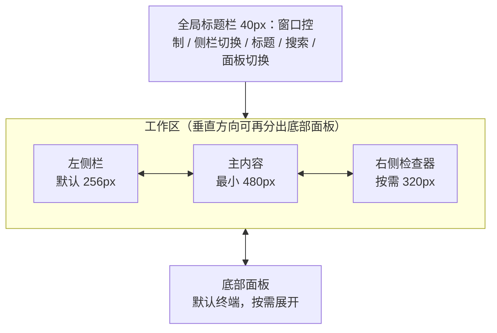

# 视觉系统与窗口布局

## 1. 视觉方向

Aestival 应呈现为安静、精确、可长期工作的桌面工具：

- 中性灰为主体，颜色只表达选中、运行、成功、警告和破坏性动作。
- 通过边框、背景层级和留白区分区域，不依赖大阴影或大色块。
- 组件高度紧凑，正文可读，长时间使用不疲劳。
- 页面标题克制；管理页标题不超过 24px，工作区标题不超过 14px。
- 不使用大面积渐变、装饰插画、拟物化、玻璃拟态和无意义动效。
- 不把 Card 当作默认容器；页面层级主要依靠留白、排版、Separator、背景层级和可调面板建立。

## 2. 设计 token

所有页面只使用 shadcn/ui 语义 token。下表描述用途，不规定业务组件写死颜色值。

| Token | 用途 |
| --- | --- |
| `background` / `foreground` | 应用主背景与主要文字 |
| `card` / `card-foreground` | 卡片、弹层、输入框浮层 |
| `popover` / `popover-foreground` | 菜单、命令面板、选择器 |
| `muted` / `muted-foreground` | 次级区域、辅助文字、未激活面板 |
| `accent` / `accent-foreground` | Hover、选中行、轻强调 |
| `primary` / `primary-foreground` | 发送、保存、创建、确认等主动作 |
| `secondary` / `secondary-foreground` | 次级操作、模式标签 |
| `destructive` | 删除、清空、绕过审批风险提示 |
| `border` / `input` / `ring` | 分割线、控件边框、键盘焦点 |
| `chart-1` 至 `chart-5` | 统计图表序列；不用于普通导航装饰 |

### 状态颜色

| 状态 | 表达方式 |
| --- | --- |
| 运行中 | `primary` 色 Marker + Spinner；文本保持正常前景色 |
| 成功 | 语义成功色图标/Badge，避免整卡铺色 |
| 警告 | 警告图标 + `Alert`，用于高上下文、权限风险、连接不稳定 |
| 错误 | `destructive` 图标/边框 + 可执行的恢复动作 |
| 已禁用 | 降低对比度，同时保留说明 Tooltip，不只依赖透明度 |
| 当前选中 | `accent` 背景 + 左侧 2px 指示或选中图标，二者至少一个 |

## 3. 字体与排版

| 场景 | 字体 | 建议尺寸/行高 |
| --- | --- | --- |
| 全局 UI | Geist，中文回退 `"PingFang SC", "Microsoft YaHei", sans-serif` | 13px / 20px |
| 页面标题 | Geist Semibold | 20–24px / 28–32px |
| 工作区标题 | Geist Medium | 13–14px / 20px |
| 消息正文 | Geist Regular | 14px / 23px |
| 辅助信息 | Geist Regular | 12px / 18px |
| 代码与终端 | Geist Mono，回退 `"SFMono-Regular", Consolas, monospace` | 12.5–13px / 19px |
| 快捷键 | Geist Mono | 11px / 16px |

文字规范：

- 中文界面优先，动作使用动词开头，如“新建连接”“打开终端”。
- 危险动作说明结果，如“删除会话”而不是“确认”。
- 时间、token、金额使用等宽数字。
- 长 ID、路径和 URL 使用省略 + Tooltip；允许复制完整值。

## 4. 密度、圆角与层级

- 基础间距单位：4px。
- 常用间距：4、8、12、16、24、32px。
- 标准控件高度：32px；紧凑行高 28px；主要按钮可为 36px。
- 图标按钮：32 × 32px；标题栏按钮：28 × 28px。
- 卡片圆角：8px；输入区主容器：12px；弹层：10px。
- 菜单项高度：28–32px。
- 主分隔线：1px `border-border`。
- 阴影仅用于浮层和拖拽对象；常驻侧栏、卡片不使用明显阴影。

### 4.1 卡片使用约束

- 禁止任何形式的卡片嵌套，包括 `Card` 内再放 `Card`，以及有边框、圆角、独立背景的“视觉卡片”内再放另一层同类容器。
- `Card` 不是页面区块的默认选择。先判断能否使用普通 Section、`Item`、`DataTable`/`Table`、`Tabs`、`Accordion`、`Collapsible`、`Separator` 或直接排版完成。
- 仅当内容是可独立识别、可整体操作或需要独立预览的对象时使用 Card，例如应用、知识库网格项、单次工具调用或主题预览。
- 父级已经使用边框、圆角或独立背景时，内部内容必须改用无外框的 Item、列表、字段分组或 Separator。
- 指标区默认使用横向指标带、Item 或排版分栏；只有少量关键指标确实需要单独点击或比较时才使用 Card。
- 同一屏幕不能呈现“所有内容都是卡片”的效果。Card 与非 Card 内容必须形成清晰主次。
- 设计验收时必须单独检查两项：是否存在卡片嵌套，以及移除某张卡片后信息结构是否仍成立。

## 5. 图标规范

### 5.1 应用品牌

| 场景 | 资源 |
| --- | --- |
| 安装包、关于页、大尺寸品牌 | `logo.svg` |
| macOS 菜单栏/任务栏模板场景 | `icon-template.svg` |
| 左侧栏底部、应用内品牌 | `icon.svg` |

应用名称：Aestival
应用图标：frontend/src/assets/icons/application/logo.svg
状态栏/任务栏中的图标：frontend/src/assets/icons/application/icon-template.svg
应用内需要展示图标的地方：frontend/src/assets/icons/application/icon.svg
应用图标不得替代“用户头像”；左侧栏底部显示图标与“Aestival”，语义是应用菜单。

### 5.2 操作图标

- 操作和状态统一使用 `lucide-react`。
- 默认尺寸 16px，紧凑菜单可用 14px，空状态可用 24–32px。
- 每个纯图标按钮必须提供 `aria-label` 与 `Tooltip`。
- 图标与文案之间使用 8px gap。
- 按钮内图标标记 `data-icon="inline-start"` 或 `data-icon="inline-end"`。
- 禁止使用 Emoji、文本符号或手绘 SVG 代替操作图标。

### 5.3 文件图标

文件树、文件页签和附件中的文件类型图标使用 Material Icon Theme；操作按钮仍使用 Lucide。文件图标不得被主题语义色重着色，避免失去语言/类型识别。
assets/icons/material 文件夹，文件后缀到图标的映射应参照 docs/文件图标映射.md

## 6. 窗口骨架

### 6.1 推荐尺寸

| 项 | 默认 | 最小 | 最大/规则 |
| --- | ---: | ---: | --- |
| 应用窗口 | 1440 × 900 | 960 × 640 | 允许全屏 |
| 标题栏高度 | 40px | 40px | 固定 |
| 左侧栏 | 256px | 220px | 340px；收起后 52px |
| 主内容 | 自适应 | 480px | 始终优先保留 |
| 右侧栏 | 340px | 280px | 窗口宽度的 45% |
| 底部面板 | 260px | 160px | 工作区高度的 55% |
| 输入区最大宽度 | 840px | 480px | 新建任务页居中 |
| 消息正文最大宽度 | 860px | 480px | 多模型模式例外 |

所有分割使用 shadcn/ui `Resizable`。拖拽柄必须：

- Hover 与键盘 focus 可见。
- 支持方向键微调。
- 双击恢复默认尺寸。
- 拖到最小阈值后自动收起。
- 收起后提供显式恢复按钮，不能只靠拖拽。

## 7. 全局标题栏

标题栏覆盖窗口全宽，不属于左侧栏或主内容，因此侧栏收起/展开不会改变标题栏内部控件位置。

- 双击标题栏空白拖动区切换窗口最大化/恢复；按钮、Tabs、输入控件和其他 `no-drag` 交互区不响应此窗口操作。
- 最大化、恢复以及从最大化状态直接拖角恢复后，960 × 640px 最小窗口尺寸继续有效。

### macOS

- 左侧预留 72px 原生红黄绿按钮安全区。
- 安全区右侧依次为：左侧栏切换、后退/前进（有历史时）、当前页面/会话标题。
- 可拖拽区域只落在空白标题区，不能覆盖 Button、Tabs 或输入控件。
- 可拖拽空白区禁止文字框选并使用普通箭头光标；进入真实按钮后恢复对应的指针或交互光标。

### Windows / Linux

- 左侧从侧栏切换按钮开始。
- 右侧保留最小化、最大化/恢复、关闭按钮区。
- 关闭按钮 Hover 使用 destructive 语义；其余按钮保持中性。

### 标题栏左右结构

| 左侧 | 右侧 |
| --- | --- |
| 窗口安全区、侧栏切换、历史导航、页面/会话标题、临时会话标记 | 全局搜索、右侧栏切换、底部面板切换、页面更多菜单、系统窗口按钮 |

标题过长时中部省略，右侧动作不被压缩。搜索、侧栏和底栏按钮始终固定展示。

## 8. 工作区布局

### 默认两栏

- 左：Sidebar。
- 右：当前页面或会话。
- 右侧栏关闭，底部面板关闭。

### 三栏

- 左：Sidebar。
- 中：聊天/文件编辑器。
- 右：文件、终端、搜索、日志或会话调试。
- 当主内容低于 480px 时，优先把右侧栏收为 `Sheet` 或关闭，不能继续挤压消息。

### 带底部面板

底部面板只分割中间与右侧工作区的垂直空间，不覆盖左侧栏。默认打开终端。标题栏中的底栏按钮负责显示/隐藏，拖拽到最小值也可收起。

## 9. 窗口宽度适配

| 宽度 | 规则 |
| --- | --- |
| ≥ 1280px | 支持完整三栏；左侧栏默认展开。 |
| 1100–1279px | 仍可三栏，但右侧栏默认 300px；打开时限制主内容最小宽度。 |
| 900–1099px | 左侧栏可保持展开；右侧栏改为覆盖式 `Sheet`，底部面板仍可用。 |
| 720–899px | 左侧栏默认收起为图标轨；管理页详情使用 `Sheet`。 |
| < 720px | 仅保留主内容；左侧栏与检查器均为 `Drawer`/`Sheet`，文件多页签允许水平滚动。 |

这不是移动端适配；目标是在桌面窄窗口中仍可完成核心操作。

## 10. 动效

- 默认动效 120–180ms；面板展开不超过 220ms。
- 仅使用淡入、轻微位移、折叠高度和状态过渡。
- 流式消息不做逐字弹跳；使用稳定文本追加和 Marker/Shimmer。
- 欢迎诗句使用 `Carousel` 淡入切换，每 12 秒一次。
- 遵循 `prefers-reduced-motion`；关闭动画后保留状态变化但取消位移与自动轮播。
- 设置页提供“动画”总开关。

## 11. 无障碍与可读性

- 文本与背景满足 WCAG AA 对比度。
- 键盘焦点使用 `ring`，不能只依赖 Hover。
- 颜色不作为唯一状态信号，配合图标、文字或形状。
- 对话流式更新区域使用克制的 `aria-live="polite"`；工具日志不逐行播报。
- `Dialog`、`Sheet`、`Drawer`、`AlertDialog` 都有可访问标题。
- 面板、页签、菜单和树形列表遵循方向键、Enter、Space、Escape 的平台习惯。
- 输入框、终端、Monaco 的快捷键优先级高于全局快捷键；冲突时显示明确提示。
