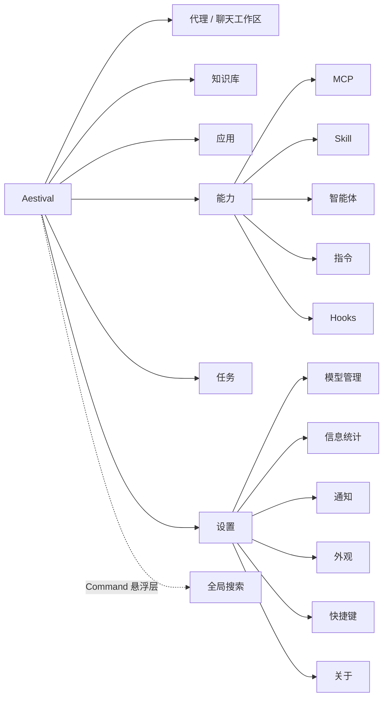
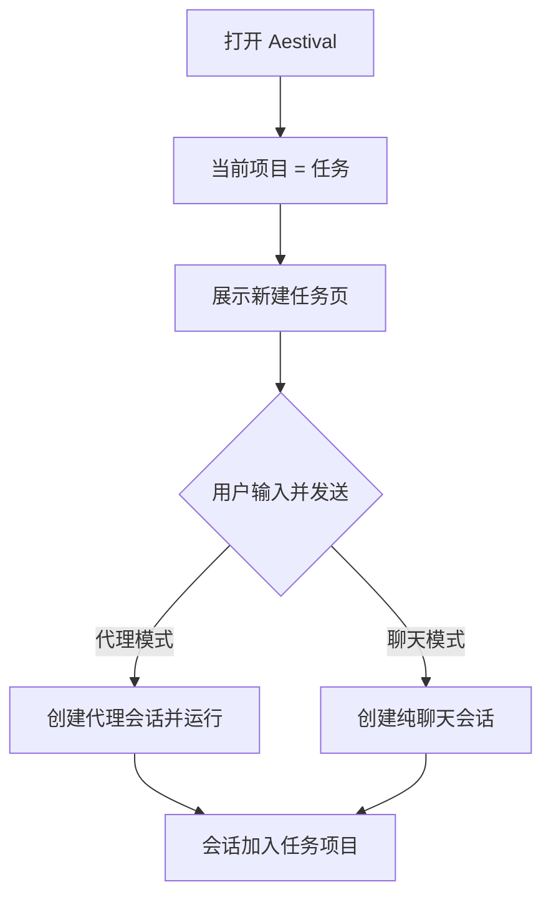
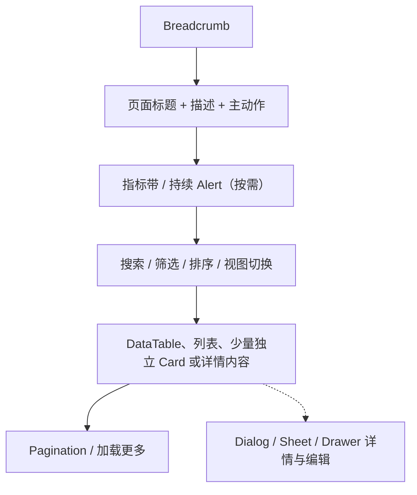

# 信息架构与导航

## 1. 顶层信息架构

“搜索”是全局功能，但呈现为悬浮 Command，而不是占据一个常驻侧栏页面。用户从任何页面都可唤起。

## 2. 页面与入口

| 页面/层 | 主入口 | 次入口 |
| --- | --- | --- |
| 新建任务 | 左侧栏“新建任务”、快捷键 | 项目/会话右键菜单 |
| 代理/聊天会话 | 项目下的会话列表 | 全局搜索结果、最近项目 |
| 知识库 | 左侧栏“知识库” | 输入框“知识库”引用、智能体配置 |
| 应用中心 | 左侧栏“应用” | AI HTML 代码块“添加到应用” |
| 能力中心 | 左侧栏“能力” | 输入框选择 Skill/MCP/智能体 |
| 定时任务 | 左侧栏“任务” | 会话“创建定时任务” |
| 设置 | 左侧栏底部 Aestival 菜单 | Command、快捷键 |
| 全局搜索 | 标题栏搜索、快捷键 | 页面内搜索转全局 |

## 3. 左侧栏

左侧栏使用 shadcn/ui `Sidebar` 的 Provider、Header、Content、Group、Menu、Footer 结构，分为三个稳定区域。

### 3.1 顶部菜单区

顺序固定：

1. `Tabs`：代理 / 聊天。
2. 新建任务。
3. 知识库。
4. 应用。
5. 能力。
6. 任务。

#### 代理 / 聊天 Tabs

- 切换只改变新建会话与当前会话的运行能力，不切换到另一套页面。
- 当前会话有未完成代理运行时切换到聊天，使用 `AlertDialog` 说明：运行会停止，后续工具不可用。
- 聊天模式标签旁显示 `MessageCircle`；代理模式使用 `Bot`。
- 收起侧栏时 Tabs 改为两个图标 Toggle，由 Tooltip 解释。

#### 菜单选中态

- 当前管理页面使用强调背景与语义图标。
- 在聊天/文件页签工作区中，“新建任务”不因打开文件而失去会话上下文；左侧显示当前会话选中。
- 菜单 Badge 仅用于需要注意的数量，如失败任务数，不显示无意义的“0”。

### 3.2 项目与会话区

项目区位于 Sidebar Content，独立滚动；顶部菜单与底部应用菜单不随其滚动。

#### 项目层

- 项目组默认折叠。
- 系统固定项目“任务”始终位于第一项，不能重命名、删除或移动。
- 启动时当前上下文默认为“任务”，即使项目 disclosure 仍处于收起状态。
- 普通项目显示名称、展开箭头和状态点；HoverCard 展示路径、分支、文件数、最近活动和 Agent/MCP 状态。
- 单击项目：设为当前上下文并展开会话。
- 再次单击或点击箭头：仅切换会话列表的折叠状态。
- 项目列表支持键盘上下移动与左右展开/收起。

#### 会话层

- 每个展开项目首次展示最近 5 个会话。
- 第 6 项为“展开更多”，点击后追加 5 个；加载中用 5 行 Skeleton。
- 已全部加载后显示“已显示全部”，不继续展示可点击项。
- 会话行显示：Star、标题、状态图标、相对时间；信息不足时只保留标题与状态。
- 运行中会话使用 Spinner，等待审批使用 ShieldQuestion，失败使用 CircleAlert，临时会话使用 Timer。
- 单击会话打开；中键/修饰键单击可在应用内新页签打开会话副视图，但主“聊天”页签仍唯一。
- 搜索、归档和 Star 会影响排序：Star 在项目内置顶，其余按最近活动排序。

### 3.3 底部应用区

使用 `SidebarFooter` 展示：

- `frontend/src/assets/icons/application/icon.svg`
- 应用名称 Aestival
- 当前版本或本地状态的可选辅助文本
- `ChevronUp` 表示可展开菜单

这里不是用户头像和账户入口，不出现登录、注册、同步或个人资料。

点击后打开 `DropdownMenu`：

| 分组 | 菜单项 | 图标 |
| --- | --- | --- |
| 工作区 | 全局搜索 | `Search` |
| 工作区 | 打开设置 | `Settings` |
| 工作区 | 键盘快捷键 | `Keyboard` |
| 数据 | 打开数据目录 | `FolderOpen` |
| 数据 | 导入配置 | `Import` |
| 数据 | 导出配置 | `Download` |
| 帮助 | 文档 | `BookOpen` |
| 帮助 | 关于 Aestival | `Info` |
| 应用 | 重新加载界面 | `RefreshCw` |
| 应用 | 退出 | `LogOut` |

“退出”与其他项分组；存在未保存文件或运行中任务时使用 `AlertDialog`。

## 4. 新建任务与会话导航

### 启动路径

如果用户先选择一个项目，再新建任务，会话归入该项目。项目切换不会自动移动已存在的会话。

### 页面历史

- 标题栏后退/前进维护应用内部导航历史，不等同于会话分叉。
- 切换侧栏项目、打开设置或知识库都会进入历史。
- 打开/关闭右侧和底部面板不进入历史。
- 文件页签切换属于工作区状态，不污染页面历史。

## 5. 主内容页签

主内容顶部使用 `Tabs` 承载：

1. 固定“聊天”页签。
2. 按打开顺序排列的文件页签。
3. 可选的应用代码页签或预览页签。

规则：

- “聊天”始终在首位、不可关闭、不可拖出。
- 文件双击从右侧文件树打开为持久页签；单击可先进入临时预览页签，下一次单击替换。
- 已编辑文件从临时页签自动转为持久页签。
- 脏文件显示圆点；关闭时使用保存/不保存/取消三动作 Dialog。
- 页签过多时水平滚动，右侧提供“所有页签”下拉与“关闭其他”。
- `Cmd/Ctrl+W` 关闭当前可关闭页签；当前为聊天页签时关闭窗口前先检查运行状态。
- 会话切换只替换聊天页签内容，不影响已打开文件。

## 6. 右侧栏与底部面板导航

标题栏固定提供：

- `PanelRight`：显示/隐藏右侧栏。
- `PanelBottom`：显示/隐藏底部面板。

右侧栏标题行包含当前面板名、固定/移动按钮、更多菜单和关闭按钮。更多菜单可选择：

- 文件
- 终端
- 搜索
- 日志
- 会话调试

底部面板使用多 Tabs：

- 首次展开默认创建“终端 1”。
- `+` 打开与右侧栏相同的类型选择菜单。
- 终端允许“终端 1、终端 2……”多实例。
- 其他面板已存在时，点击对应类型只聚焦，不创建重复实例。
- 面板页签可在右侧栏与底部面板之间移动。
- 关闭最后一个页签后显示 `Empty`，提供五种面板选择。

详细行为见 [09-工作区面板与文件预览.md](./09-工作区面板与文件预览.md)。

## 7. 管理页面统一骨架

知识库、应用、能力、任务和设置共享以下结构：

统一规则：

- 页面内只保留一个主动作。
- 宽屏使用右侧 `Sheet` 或分割详情；窄屏使用 `Drawer`。
- 筛选条件通过 Badge 可见且可逐项清除。
- 空状态说明“为什么为空”和“下一步做什么”。
- 列表与网格视图选择可记忆到本地设置。
- 管理页默认优先列表、表格、Item 和直接分区；只有独立对象的网格浏览才使用 Card。
- Card 内部不得再放 Card；详情 Sheet/Dialog 也不能靠多层卡片堆叠建立层级。

## 8. 深链接与恢复

未来路由应能表达：

- 当前顶层页面。
- 当前能力中心 Tab。
- 当前设置分类。
- 当前项目与会话。
- 当前知识库/数据连接/外部消息连接/应用/任务详情；外部消息连接的深链接只保存安全定位信息，不包含凭据、配对码或消息正文。

右侧栏、底部面板、分割比例、最近页签属于本地工作区状态，不要求进入 URL。应用重启后：

- 恢复最后页面与面板布局。
- 有敏感或临时内容时不自动恢复正文，只恢复安全的定位信息。
- 上次处于临时会话时，默认回到新建任务并提示可从恢复记录找回。
