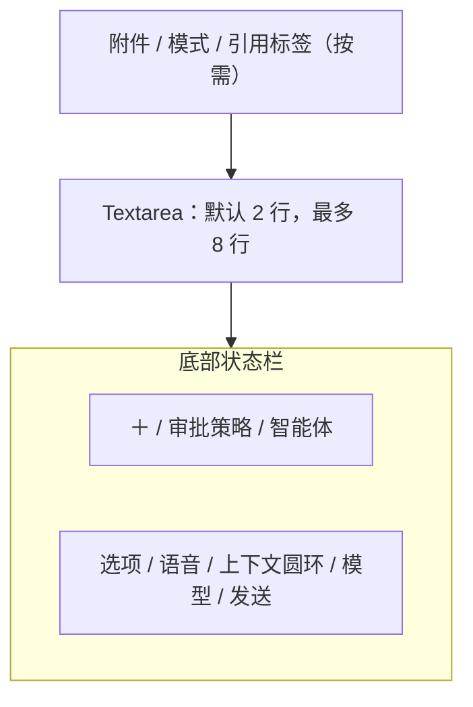

# 代理与聊天

> 消息内容渲染、Markdown/KaTeX/Mermaid、状态 Marker、流式事件和滚动行为的详细规范见 [12-聊天内容渲染与流式交互](./12-聊天内容渲染与流式交互.md)。本文件保留页面、能力边界和会话级交互基线。

## 1. 模式定义

代理和聊天共享页面、会话、消息与输入框，但能力边界不同。

| 能力 | 代理模式 | 聊天模式 |
| --- | --- | --- |
| 普通流式对话 | 支持 | 支持 |
| 文件/图片/文档作为输入 | 支持 | 支持，只读 |
| 工具调用 | 支持，受审批策略约束 | 禁止 |
| MCP / Skill / Hooks / 工作流 | 支持 | 禁止 |
| 读取/写入记忆 | 支持，写入可审批 | 禁止主动工具式读写 |
| 网络搜索 | 支持 | 禁止 |
| 知识库检索 | 支持 | 禁止主动检索；可把已选摘录作为附件 |
| 修改文件/执行终端 | 支持，受审批策略约束 | 禁止 |
| 思考大纲、导出、分叉、朗读 | 支持 | 支持 |
| 多模型同时对话 | 支持 | 支持 |

聊天模式下，被禁用项仍可见，但显示禁用状态与 Tooltip“聊天模式不调用工具”，让用户理解能力差异。

## 2. 页面状态

### 2.1 新建任务

进入应用或点击“新建任务”后：

- 当前项目信息居中显示在欢迎语上方：项目名、路径、分支/状态、已关联知识库。
- 当前为“任务”项目时，显示“Aestival 默认任务”，不展示虚构路径。
- 中部展示随时间变化的诗句。
- 底部中央展示输入框，最大宽度 840px。
- 没有消息列表和空白气泡。

### 2.2 已有会话

- 顶部为主内容 Tabs 与会话标题信息。
- 中部唯一滚动容器为 shadcn/ui `MessageScroller`；其 Provider、Viewport、Content、Item 和回到最新按钮统一承载消息滚动、未读新增和阅读位置。侧栏、文件树和其他面板可以使用普通 `ScrollArea`，不得在聊天区另造滚动监听。
- 底部输入框固定在主区底部，不随消息正文滚走。
- 滚动离开底部时显示“回到最新消息”按钮与未读新增数量。

### 2.3 运行中

- 会话标题旁显示运行状态 Marker。
- 发送按钮切换为停止按钮。
- 工具审批在消息流中就地出现，同时标题栏显示等待审批状态。
- 左侧会话行同步显示 Spinner 或 ShieldQuestion。

## 3. 欢迎诗句

诗句仅选清代以前作品。
以下是诗句实例，请予以扩充，每个时间段的诗句候选应当维护 150～200 个。候选与作者、题名统一配置在 `frontend/src/data/new-task-content.json`，按本地时间段从对应候选中随机选择。默认只展示诗句正文；设置中的“欢迎诗句署名”可以切换为作者、题名或作者与题名。

| 时间 | 诗句候选 |
| --- | --- |
| 00:00–04:59 | “星垂平野阔，月涌大江流。”——杜甫《旅夜书怀》；“月落乌啼霜满天，江枫渔火对愁眠。”——张继《枫桥夜泊》；“明月松间照，清泉石上流。”——王维《山居秋暝》 |
| 05:00–07:59 | “晨兴理荒秽，带月荷锄归。”——陶渊明《归园田居·其三》；“清晨入古寺，初日照高林。”——常建《题破山寺后禅院》；“绿树村边合，青山郭外斜。”——孟浩然《过故人庄》 |
| 08:00–11:59 | “晴空一鹤排云上，便引诗情到碧霄。”——刘禹锡《秋词》；“读书不觉已春深，一寸光阴一寸金。”——王贞白《白鹿洞二首·其一》；“等闲识得东风面，万紫千红总是春。”——朱熹《春日》 |
| 12:00–13:59 | “接天莲叶无穷碧，映日荷花别样红。”——杨万里《晓出净慈寺送林子方》；“日长篱落无人过，惟有蜻蜓蛱蝶飞。”——范成大《四时田园杂兴》；“梅子金黄杏子肥，麦花雪白菜花稀。”——范成大《四时田园杂兴》 |
| 14:00–17:59 | “长风破浪会有时，直挂云帆济沧海。”——李白《行路难》；“沉舟侧畔千帆过，病树前头万木春。”——刘禹锡《酬乐天扬州初逢席上见赠》；“纸上得来终觉浅，绝知此事要躬行。”——陆游《冬夜读书示子聿》 |
| 18:00–20:59 | “落霞与孤鹜齐飞，秋水共长天一色。”——王勃《滕王阁序》；“一道残阳铺水中，半江瑟瑟半江红。”——白居易《暮江吟》；“大漠孤烟直，长河落日圆。”——王维《使至塞上》 |
| 21:00–23:59 | “海上生明月，天涯共此时。”——张九龄《望月怀远》；“何当共剪西窗烛，却话巴山夜雨时。”——李商隐《夜雨寄北》；“今人不见古时月，今月曾经照古人。”——李白《把酒问月》 |

关闭动画或启用 reduced motion 时，只在打开新建任务页时选一条，不自动轮播。启用动画也不自动轮播，页面只在新建任务挂载时选择一次，避免欢迎区域不断变化。

### 3.1 快捷建议

- 新建任务页的四个快捷建议从 `frontend/src/data/quick-suggestions.ts` 内置的 200 条推荐中随机抽取。
- 每次新建任务页挂载时抽取 4 条，使用 Fisher–Yates 洗牌保证同一组内不重复；页面停留期间不自动轮换。
- 每条推荐包含唯一 ID、简短标题、可填入输入框的 prompt，以及与意图匹配的 Lucide 图标；点击只写入当前草稿，不直接发送、不接入后端业务。
- 推荐内容覆盖代码理解、功能构建、审查调试、文档数据、Git 发布、界面设计、工作流和安全检查等常见入口。

## 4. 输入框结构

输入框是由 shadcn/ui 组件组合的业务区域，不新造基础控件。

### 4.1 新建任务提示文案

- 输入框 placeholder 配置在 `frontend/src/data/new-task-content.json` 的 `placeholders` 数组中，当前维护 160 条短句。
- placeholder 与时间无关；新建任务页挂载时、进入每个会话时分别纯随机选择一条，并在该页面生命周期内保持稳定，不随输入或流式更新重抽。
- placeholder 只作为提示，不写入草稿状态；用户开始输入后立即由真实草稿内容覆盖。
- 配置为空或读取失败时回退为“随心输入，描述你想完成的任务…”。

### 4.1 文字输入

- 使用 `Textarea` + `InputGroup`。
- 默认 2 行，随内容增长，最多 8 行；超过后输入区内部滚动。
- `Enter` 发送，`Shift+Enter` 换行；可在快捷键设置中改为 `⌘/Ctrl+Enter` 发送。
- 中文输入法组合状态下 Enter 不发送。
- 粘贴图片生成附件；粘贴大段文本时提示“保留正文”或“作为文本附件”。
- 草稿按会话本地保存；临时会话关闭后清除，除非用户转为普通会话。

### 4.2 左侧控制

#### 加号菜单

| 分组 | 项 | 图标 | 行为 |
| --- | --- | --- | --- |
| 引用 | 引用文件 | `FilePlus` | 文件选择器，多选 |
| 引用 | 引用文件夹 | `FolderPlus` | 显示包含范围与排除规则 |
| 引用 | 添加图片 | `ImagePlus` | 支持粘贴、拖入和选择 |
| 模式 | 计划模式 | `ListTodo` | 生成/确认计划后再执行 |
| 模式 | 目标模式 | `Target` | 设定可持续追踪的完成目标 |
| 工作区 | 初始化项目 | `PackagePlus` | 代理模式；需要文件权限 |
| 能力 | MCP 状态 | `PlugZap` | 打开状态 Popover，不直接启用 |
| 能力 | 选择 Skill | `Blocks` | 多选 Combobox |

聊天模式下，“初始化项目”“MCP”“Skill”禁用；引用文件、文件夹、图片保持只读可用。

#### 审批策略

`DropdownMenu` + `RadioGroup`：

| 策略 | 图标 | 说明 |
| --- | --- | --- |
| 请求审批 | `ShieldQuestion` | 文件写入、命令、网络、记忆写入等敏感动作逐项请求 |
| 自动审批 | `ShieldCheck` | 在已授予范围内自动执行，越界时仍请求 |
| 绕过审批 | `ShieldOff` | 不请求确认；首次选择和每次新项目选择都使用风险 AlertDialog |

当前策略始终显示文字，不只显示盾牌颜色。聊天模式下整项显示“工具已禁用”。

#### 智能体选择

- 使用 `Combobox`，展示图标、名称、简介、允许工具范围和状态。
- 默认“通用智能体”。
- 支持搜索、最近使用和固定。
- 与当前模式冲突的智能体置灰，并说明冲突能力。
- 选择后可通过 HoverCard 查看 Skill、指令与 Hooks 摘要。

### 4.3 右侧控制

| 控件 | 组件 | 行为 |
| --- | --- | --- |
| 选项 | `DropdownMenu` | 全屏输入、复制、剪切、清空 |
| 语音 | `Button` + `Popover` | 开始/停止录音、输入设备、实时转写状态 |
| 上下文圆环 | `Chart` + `Popover` | 已用/上限比例，点击看分项 |
| 模型 | `Combobox` | 单模型或多模型选择、上下文大小 |
| 发送/停止 | 圆形 `Button` | 有内容时发送；运行时停止 |

#### 选项菜单

- 全屏输入：`Dialog`，复用同一份草稿与附件。
- 复制：有选区复制选区，无选区复制全部输入。
- 剪切：规则同复制。
- 清空：清除正文和未发送附件，并提供可撤销 Sonner。

#### 上下文圆环

- 圆环中心显示百分比。
- 低于 70% 为中性；70–89% 显示警告；≥90% 显示高风险。
- Popover 展示：消息、系统指令、附件、工具结果、知识库、记忆、预留输出 token。
- 提供“自动压缩”Switch、“立即压缩”按钮和上下文大小 Select。
- 估算与服务商最终 token 不同时，标为“估算”。

#### 模型选择

- 单模型模式：选择一个模型。
- 多模型模式：使用带复选的 Combobox，选择 2–4 个模型。
- 每个模型显示供应商别名、能力 Badge、上下文上限、估算价格和可用状态。
- 上下文大小可选“自动”或模型支持的档位，不允许超过服务商上限。

#### 语音输入

- 首次使用请求麦克风权限。
- 录音中按钮变为 `MicOff`，Popover 显示时长、输入电平和实时转写。
- 转写只写入草稿，不自动发送。
- 权限拒绝使用 Alert 给出系统设置路径。

## 5. Slash Command

仅当输入在第一个非空白字符处以 `/` 开始时显示内联 `Command` 浮层。

| 命令 | 图标 | 行为 |
| --- | --- | --- |
| `/compact` | `Shrink` | 上下文压缩 |
| `/plan` | `ListTodo` | 开启/关闭计划模式 |
| `/goal` | `Target` | 开启/关闭目标模式 |
| `/fork` | `GitFork` | 从当前或指定消息分叉 |
| `/stats` | `ChartNoAxesCombined` | 打开会话统计 |
| `/skill` | `Blocks` | 选择 Skill |

交互：

- `↑/↓` 选择，`Tab` 补全，`Enter` 执行，`Esc` 关闭。
- 命令支持别名和中文关键词搜索。
- 不可用命令保留在列表中并解释原因。
- 执行后将命令转为模式 Badge 或直接打开对应 Dialog，不把命令文本发送给模型。

## 6. 消息结构

使用官方 `Message`、`Bubble`、`MessageScroller`、`Marker`、`AttachmentNew`、`Avatar`、`Collapsible`、`Tabs` 和少量 `Card`；如果当前 registry 只提供带 `New` 的等价变体，则按组件矩阵选择一套实现，不同时渲染两套。消息本体不是 Card，避免整条会话变成卡片列表。内容渲染和流式事件按 [文档 12](./12-聊天内容渲染与流式交互.md) 执行。

### 6.1 用户消息

- 靠右、轻量 Bubble。
- 显示正文、附件、引用和发送时间。
- Hover/操作按钮键盘聚焦后，在 Bubble 外侧显示复制、编辑并重发、分叉、更多；操作层使用浮动定位，不增加 Bubble 高度。
- 编辑并重发会保留原消息，并从该点创建新分支，避免静默改写历史。

### 6.2 AI 消息

- 靠左，正文使用较平的布局，避免每条都套厚重 Card。
- Header：模型/智能体、运行状态、耗时。
- Body：Markdown、代码、媒体、工具与思考块。
- 尾部浮动操作层：复制、重新生成、朗读、分叉、导出、更多；位于消息内容边界外，不参与消息本体高度计算。
- 多模型结果显示模型标签和单独统计。

### 6.3 消息内容块

| 内容 | 展示 |
| --- | --- |
| Markdown | `react-markdown` + GFM；安全 HTML 子集、标题、列表、表格、引用、链接完整支持 |
| 数学公式 | `remark-math` + `rehype-katex`；公式错误保留源码并提供降级提示 |
| 代码 | 语言、复制、保存为文件；HTML/CSS/JS 增加“添加到应用” |
| 代码高亮 | Shiki 按语言动态加载；未知语言降级为纯文本 |
| Mermaid | 独立内容块，源码/预览 Tabs；流式防抖、缩放、复制、SVG/PNG Mock 导出 |
| 图片 | AspectRatio 预览；缩放、打开、下载、复制 |
| SVG | 安全预览；源码/预览 Tabs；下载 |
| 文档附件 | AttachmentNew；名称、类型、大小、解析状态 |
| 引用 | HoverCard 显示来源、页码/行号和完整片段 |
| 表格 | 横向 ScrollArea；可复制 CSV |

## 7. 流式输出与思考大纲

### 7.1 流式输出

- 已生成文本稳定保留，光标 Marker 只出现在当前块末尾；完整的事件类型、去重序号和内容块规则见 [文档 12 §5](./12-聊天内容渲染与流式交互.md#5-消息结构与-ui-适配事件)。
- 状态顺序：等待模型 → 思考中 → 输出中 → 工具调用/审批 → 继续输出 → 完成。
- 用户滚动离开底部后不强制拉回。
- 网络中断保留已生成内容，并显示“继续生成”“重试”。
- 当前运行状态进入消息流的 `Marker`，不在输入框上方重复显示一条独立运行状态。

### 7.2 思考

展示的是模型提供的思考摘要/大纲，不展示系统隐藏推理。

- `Collapsible` 标题显示“思考大纲”、耗时和状态。
- 流式时用 Shimmer + Marker；活动状态使用 `role="status"`，完成、失败和取消作为稳定历史事件。
- 展开后显示阶段标题、简短摘要、相关工具节点。
- 完成后默认收起，记住用户偏好。
- 模型不提供大纲时不伪造内容，只显示“模型未返回思考摘要”。

## 8. 工具与能力消息

### 8.1 工具调用

每次独立工具调用可使用一张紧凑 Card，直接位于消息内容流中，内部不得再嵌套 Card：

- 工具图标与名称。
- 状态：准备、等待审批、运行、成功、失败、取消。
- 参数摘要。
- 执行时长。
- `Collapsible` 内的输入、输出与错误。
- “在会话调试中查看”入口。

Card 内的审批区使用普通分区、Separator 与按钮组，不再套审批卡，内容包括：

- 动作与目标。
- 风险说明。
- 影响范围。
- “允许一次”“本会话允许”“拒绝”。
- 可选“记住此项目规则”，高风险动作不允许永久记住。

### 8.2 记忆

- 读取记忆：显示命中条数和可展开摘要。
- 写入记忆：显示将写入的内容、作用域和过期策略；请求审批策略下先确认。
- 消息更多菜单可查看本次会话使用过的记忆。

### 8.3 网络搜索

- 运行中显示查询词与结果计数。
- 完成后在回答段落旁放引用 Marker。
- 引用 HoverCard 展示标题、域名、摘要和打开链接。
- 搜索失败不阻断可用的模型回答，但必须标出未验证部分。

### 8.4 知识库检索

- 展示知识库名、查询、命中数、分数与耗时。
- 引用可定位到文件页码、段落、数据库表/行或文档块。
- 用户可将某个命中固定到后续上下文。

### 8.5 工作流

- 用纵向步骤列表展示触发器、步骤、分支和结果。
- 当前步骤使用 Spinner，成功/失败有图标。
- 支持停止、重试失败步骤和打开会话调试。

## 9. 多模型同时对话

### 9.1 展示模式

- 默认“模型 Tabs”：节省宽度，流式状态显示在各 Tab。
- 宽屏可切换“并排比较”：2 个模型双列，3–4 个模型横向 ScrollArea。
- 用户消息只展示一次，模型回复按同一轮次对齐。
- 支持“汇总比较”，由指定模型读取各回答后生成综合结果。

### 9.2 工具安全

纯聊天模式下，各模型可同时流式回复。

代理模式默认分两阶段：

1. 多模型并行提出方案，不执行有副作用工具。
2. 用户选择一个“执行模型”，由其继续工具调用。

高级设置可开启“各模型独立执行”，但必须：

- 每个模型有独立工具日志和审批。
- 文件写入使用独立快照/分支。
- 不允许两个模型同时修改同一路径。
- UI 明确显示可能产生额外费用和副作用。

## 10. 上下文、Token 与费用

### 10.1 Token 估算

- 输入框底部可在 HoverCard 中展示当前草稿预计输入 token。
- 附件解析完成前显示“估算中”。
- 发送后记录服务商返回的实际 input/output token；未返回则继续标记估算。

### 10.2 自动上下文压缩

- 可全局、项目、会话三级配置，越具体优先级越高。
- 达到选定上限的 80% 时预警，90% 时按设置自动压缩。
- 压缩在消息流中生成事件卡，显示压缩前后 token、范围和摘要。
- 用户可查看摘要、重新压缩或从压缩前分叉。

### 10.3 会话统计

`Dialog` 使用 Tabs：

| Tab | 内容 |
| --- | --- |
| 概览 | 模型、智能体、消息条数、运行时长、工具调用数 |
| Token | 输入、输出、缓存读写、压缩前后变化 |
| 费用 | 总费用、按模型、按轮次、估算/已结算 |
| 计费段 | 跨段计费区间、价格、token 数、金额 |
| 工具 | 调用次数、成功率、耗时、失败明细 |

跨段计费以 Table 显示每个价格区间，不只给总金额。

## 11. 会话分叉与管理

### 11.1 分叉

从消息操作、右键菜单或 `/fork` 打开 Dialog：

- 选择分叉点。
- 新会话标题。
- 目标项目。
- 是否继承附件、固定引用、记忆和模式。
- 显示预计继承的上下文 token。

分叉完成后新会话打开，原会话不改变，并在两边显示可导航的分叉关系。

### 11.2 临时会话

- 新建时标题栏显示 Timer Badge。
- 不进入普通历史、默认不写记忆。
- 关闭时提供“保存到任务项目”“直接丢弃”“取消”。
- 用户可随时转为普通会话。

### 11.3 会话管理

支持：

- 重命名。
- 删除。
- 归档/取消归档。
- 搜索。
- Star/取消 Star。
- 移动项目。
- 导出。
- 查看统计。
- 创建定时任务。

所有动作在侧栏、会话标题菜单和全局 Command 中保持名称一致。

## 12. 复制、重新生成与朗读

- 复制支持纯文本、Markdown、代码块和选区。
- 重新生成保留旧版本，用版本 Tabs 切换，不静默覆盖。
- 朗读支持播放/暂停、语速和语音选择；播放状态在离开消息后仍可从底部迷你控制条停止。
- 重新生成与多模型同时对话会明确增加预计费用。

## 13. 导出

会话与单条消息支持 Markdown、HTML、PDF、Word。

导出 Dialog：

1. 范围：完整会话、当前分支、选定消息。
2. 内容：思考大纲、工具输入输出、引用、附件目录、统计。
3. 隐私：脱敏 API URL、路径、环境变量、调试字段。
4. 媒体：嵌入、复制到资源目录或只保留链接。
5. 格式预览与保存位置。

导出过程使用 Progress；完成后 Sonner 提供“在系统中显示”。

## 14. AI 代码加入应用中心

当 AI 输出可组合的 HTML + CSS + JavaScript：

- 代码块顶部显示“预览”和“添加到应用”。
- 单块 HTML 内含样式/脚本时也可识别。
- 点击后打开应用创建 Dialog，预填名称、代码与来源会话。
- 用户必须设置或确认图标、权限和网络策略。
- 创建后可“留在会话”或“打开应用编辑器”。

详细流程见 [06-应用中心.md](./06-应用中心.md)。

## 15. 页面状态

| 状态 | 展示 |
| --- | --- |
| 空会话 | 欢迎诗句、项目信息、输入框 |
| 模型加载 | 消息 Skeleton + “正在连接模型” |
| 流式输出 | Marker/Shimmer，停止按钮；详细事件和滚动规则见 [文档 12](./12-聊天内容渲染与流式交互.md) |
| 等待审批 | 内联审批区或独立审批 Card + 标题/侧栏状态；两者不嵌套 |
| 工具失败 | 错误 Alert、重试与查看日志 |
| 上下文不足 | 警告 Alert、压缩/增大上下文/新会话 |
| 模型不可用 | 保留草稿，提供切换模型 |
| 离线 | 本地功能可用；网络模型和市场入口禁用并解释 |
| 取消运行 | 保留已输出内容，消息标记“已停止” |
| 完成 | 显示消息操作、统计更新、会话持久化状态 |
