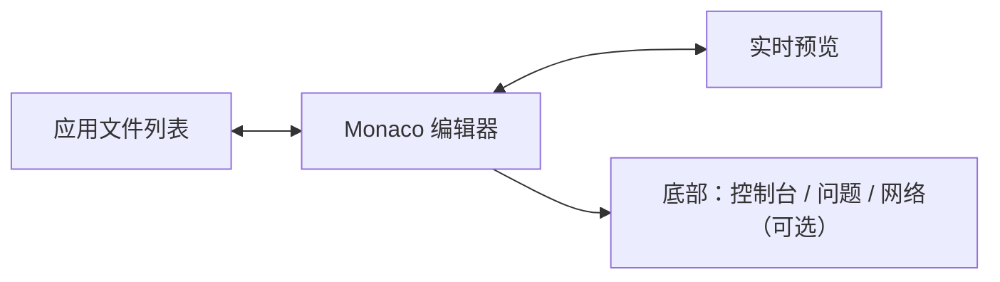

# 应用中心

## 1. 定位

应用中心用于保存、编辑和运行由用户编写或 AI 生成的 HTML + CSS + JavaScript 小应用。应用默认完全本地，不要求登录；运行时可在 Aestival 主窗口预览，也可通过 Wails 多窗口能力在独立窗口打开。

## 2. 页面结构

顶部：

- Breadcrumb。
- 标题“应用”与说明。
- 主动作“新建应用”。

统计区默认使用 `Item + Separator` 的横向指标带，宽屏且需要独立操作时才切换为并列 Card：

- 应用总数。
- 最近运行。
- 需要修复。
- 已授予网络/文件权限的应用数量。

工具栏：

- Command 搜索名称、描述、标签。
- Select 筛选来源：手动、AI 会话、导入。
- Select 筛选状态：可运行、草稿、错误、已停用。
- ToggleGroup：网格/列表。
- 排序 Dropdown。

## 3. 应用卡片

Card 内容：

- 应用图标，缺失时使用应用内默认图标而不是 Emoji。
- 名称、说明。
- 来源 Badge。
- 最近修改与最近运行。
- 权限摘要：网络、文件、剪贴板等。
- 主动作“打开”。
- 次动作“编辑”与更多菜单。

右键菜单：

- 打开。
- 在新窗口打开。
- 编辑代码。
- 复制一份。
- 修改图标。
- 导出。
- 在来源会话中显示。
- 停用/启用。
- 删除。

## 4. 新建应用入口

点击“新建应用”打开 Dialog，先选择来源：

| 来源 | 图标 | 说明 |
| --- | --- | --- |
| 空白应用 | `FileCode2` | 创建 HTML、CSS、JavaScript 基础文件 |
| 从文件导入 | `Import` | 导入单个 HTML 或应用目录 |
| 从剪贴板 | `ClipboardPaste` | 解析 HTML/CSS/JavaScript |
| 从会话选择 | `MessagesSquare` | 选择历史 AI 代码块 |

随后进入应用编辑器，不在小 Dialog 内完成复杂代码编辑。

## 5. 从 AI 消息添加

### 5.1 触发条件

AI 消息中出现以下任一情况时，在代码块标题栏显示“添加到应用”：

- 单个完整 HTML，内部含 `<style>`/`<script>`。
- 同一回答中存在可配对的 HTML、CSS、JavaScript 代码块。
- 模型明确返回应用清单与多文件代码。

不能确定组合关系时，按钮改为“选择代码创建应用”，由用户勾选文件。

### 5.2 创建 Dialog

预填：

- 名称。
- 简短说明。
- 代码文件。
- 来源会话、消息与模型。

需要用户确认：

- 应用图标。
- 入口 HTML。
- 窗口尺寸。
- 网络访问。
- 本地文件访问。
- 剪贴板访问。

创建成功后 Sonner 提供“打开编辑器”；原消息显示“已添加到应用：名称”，支持定位。

## 6. 应用编辑器

### 6.1 布局

- 标准窗口默认“文件列表 + 编辑器 + 预览”三栏。
- 窄窗口使用 Tabs 在编辑器和预览之间切换。
- 底部调试区使用 Resizable，多 Tab。
- 代码保存后预览刷新；有语法错误时保留上一次成功预览并显示 Alert。

### 6.2 顶部动作

- 返回应用中心。
- 应用名称与保存状态。
- 运行。
- 在新窗口打开。
- 预览尺寸 Select。
- 权限。
- 更多。

### 6.3 文件

默认文件：

- `index.html`
- `styles.css`
- `script.js`

允许新建、重命名、移动和删除。删除入口文件时阻止并说明；多文件应用允许配置入口。

### 6.4 代码编辑

- Monaco Editor。
- HTML/CSS/JavaScript/JSON 语法高亮。
- 查找、替换、格式化、诊断。
- `⌘/Ctrl+S` 保存。
- 文件有未保存修改时显示脏点。
- 编辑器右键菜单遵循全局 Monaco 菜单规范。
- “AI 修改”会把选区、当前文件和明确指令发送到新建/当前代理会话，应用修改以差异预览确认。

### 6.5 预览

- 使用 `AspectRatio` 切换常见尺寸：自适应、桌面、平板、手机、自定义。
- 工具栏：刷新、后退、前进、打开 DevTools、截图、在新窗口打开。
- 运行错误在预览上方用 Alert，不用浏览器原生错误页。
- 控制台错误可点击定位到文件行。

## 7. 应用图标

“修改图标”使用 Dialog：

- 选择默认应用图标。
- 从本地选择 PNG/JPEG/SVG。
- 从项目文件中选择。
- 裁切与背景预览使用 `AspectRatio`。
- 展示 16、32、64、128px 预览。

不自动生成占位图标，不用文字首字母冒充已设置图标。未设置时明确使用 Aestival 默认应用图标。

## 8. 多窗口

“在新窗口打开”：

- 创建独立应用窗口。
- 标题栏显示应用图标、名称和最小必要窗口控制。
- 默认尺寸来自应用设置，可记住最后位置和大小。
- 同一应用默认聚焦已存在窗口；更多菜单可“打开新实例”。
- 独立窗口关闭不退出 Aestival 主应用。
- 应用被删除或停用时，已打开窗口先提示并安全关闭。

窗口设置：

- 默认宽高。
- 最小宽高。
- 是否允许调整大小。
- 是否置顶。
- 启动时是否恢复。

## 9. 权限与安全

生成代码在预览/运行前先过权限层。权限使用 `Checkbox`/`Switch`，分为：

- 网络：关闭、指定域名、全部。
- 文件：关闭、只读目录、可写目录。
- 剪贴板：读取、写入分别授权。
- 打开外部链接。
- 通知。

规则：

- 默认全部关闭。
- 新增权限需要再次确认。
- 权限变化写入应用活动记录。
- 外部脚本、远程资源和 `eval` 风险用 Alert 显示。
- 预览与主应用存储、DOM、快捷键隔离。
- 运行前展示实际权限摘要，不能以“已信任”隐藏高风险变化。

## 10. 应用详情

Tabs：

- 概览：说明、图标、来源、版本、最近运行。
- 代码：进入编辑器。
- 权限：当前授权与历史。
- 活动：打开、保存、错误、权限变化。
- 设置：窗口、入口、标签、停用。

来源于 AI 时，“来源”区可打开原会话和消息。

## 11. 导入导出

导入：

- 单 HTML。
- 包含 HTML/CSS/JS/资源的目录。
- Aestival 应用包。

导出：

- 源代码目录。
- 单文件 HTML（可合并时）。
- Aestival 应用包，包含 manifest、图标、代码和权限声明，不包含本机密钥。

冲突时使用 RadioGroup：覆盖、保留两份、取消；覆盖前展示差异与备份说明。

## 12. 页面状态

| 状态 | 展示 |
| --- | --- |
| 无应用 | Empty + 新建应用 + 从会话添加说明 |
| 正在导入 | Progress + 当前文件 |
| 草稿 | Badge；可编辑，不允许无入口运行 |
| 语法错误 | Alert + 问题列表；保留上次成功预览 |
| 运行错误 | 预览错误层 + 控制台入口 |
| 权限阻止 | 内联权限请求，不弹系统原生 prompt |
| 外部资源离线 | 保留本地内容，列出加载失败资源 |
| 保存成功 | 保存状态更新 + Sonner |
| 未保存离开 | Dialog：保存、不保存、取消 |
