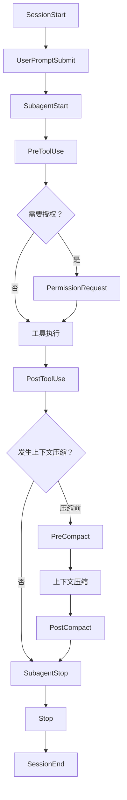

# 能力中心

## 1. 页面骨架

能力中心顶层使用 `Tabs`：

1. MCP
2. Skill
3. 智能体
4. 指令
5. Hooks

标题栏主动作随当前 Tab 变化。每个 Tab 使用一致的搜索、筛选、列表/网格、详情 Sheet 和右键菜单模式。

## 2. MCP

### 2.1 MCP 首页

统计区默认使用 `Item + Separator` 的指标带：

- 已安装。
- 正在运行。
- 异常。
- 可更新。

工具栏：

- Command 搜索名称、工具和描述。
- 类型筛选：命令（stdio）、HTTP。
- 状态筛选。
- 来源筛选：手动、AI、市场、导入。
- 主动作“安装 MCP”。

列表项显示：

- 名称、说明、来源。
- 类型 Badge。
- 提供的工具数量。
- 状态 Marker。
- 最近启动/调用。
- 日志。
- 开关。
- “查看工具”和更多菜单。

### 2.2 安装入口

“安装 MCP”打开 Dialog，使用 Tabs：

- 手动安装。
- AI 一键安装。
- MCP 市场。

#### 手动安装：命令（stdio）

表单：

- 名称。
- 命令。
- 参数列表，支持逐项添加与排序。
- 工作目录。
- 环境变量 Key/Value；敏感值可引用本地 Secret。
- 启动超时。
- 工具调用超时。
- 自动启动 Switch。

提交前先显示命令预览、工作目录和环境变量名；敏感值始终遮挡。

#### 手动安装：HTTP

表单：

- 名称。
- Endpoint。
- 传输类型。
- Headers。
- 认证：无、Bearer、API Key、自定义 Header。
- 超时、重试、TLS。
- 健康检查地址。

凭据只通过本地安全存储引用，不在列表、日志或导出中明文展示。

#### 测试

安装前执行：

1. 配置校验。
2. 连接/启动。
3. 协议握手。
4. 工具列表读取。
5. 关闭测试实例。

Progress 可见；失败提供脱敏诊断。

### 2.3 AI 一键安装

流程：

1. 用户输入自然语言需求或粘贴安装说明。
2. AI 生成结构化安装计划。
3. UI 展示来源、命令、下载、文件写入、环境变量和权限。
4. 用户逐项确认。
5. 执行安装并实时展示步骤。
6. 测试工具列表。

AI 不能绕过审批直接运行安装命令。计划变更时必须重新确认。

### 2.4 MCP 市场

- 默认使用 Item/列表；切换网格视图时，单个市场条目可使用独立 Card。
- 分类、平台、传输类型、更新时间筛选。
- 详情 Drawer：说明、工具、安装命令、权限、来源、版本、许可证。
- “安装”先进入配置与权限确认，不直接执行。
- 离线时展示缓存与更新时间。

### 2.5 MCP 详情

Tabs：

- 概览。
- 工具。
- 配置。
- 日志。
- 使用记录。

工具表展示名称、说明、输入 Schema、权限等级、最近调用。允许在测试面板中输入参数，但执行前遵循审批策略。

## 3. Skill

### 3.1 Skill 首页

统计区默认使用 `Item + Separator` 的指标带：

- 已安装。
- 已启用。
- 有更新。
- 自定义。

工具栏：

- 搜索。
- 来源筛选。
- 状态筛选。
- 兼容来源：原生、Claude Code、Codex。
- 主动作“创建 Skill”。

Skill 项显示名称、简介、版本、来源、关联智能体、最近使用和状态。

### 3.2 创建与编辑

使用全页或宽 Sheet，Tabs：

- 基本信息。
- `SKILL.md`。
- 资源与脚本。
- 触发条件。
- 权限。
- 测试。

编辑器使用 Monaco；右侧提供结构检查：

- Frontmatter。
- 名称与说明。
- 触发规则。
- 引用文件是否存在。
- 脚本权限。
- 冲突与循环引用。

保存前显示校验 Alert；删除使用 AlertDialog 并列出关联智能体。

### 3.3 Skill 市场

市场数据可接入 `https://www.skills.sh` 接口：

- 搜索、分类、来源、更新时间、兼容性筛选。
- 详情显示 README/SKILL、文件清单、安装脚本、权限、版本和来源链接。
- 安装前展示差异和目标目录。
- 更新时支持版本比较与保留本地修改。

网络不可用时不伪造实时数据，显示上次缓存时间。

### 3.4 AI 创建与一键安装

AI 创建：

1. 描述目标。
2. AI 输出文件计划。
3. 预览 `SKILL.md`、脚本和资源。
4. 权限审查。
5. 用户确认创建。
6. 校验与试运行。

AI 一键安装与 MCP 相同，必须先展示安装计划和副作用。

### 3.5 导入

支持：

- Claude Code Skill 目录。
- Codex Skill 目录。
- 压缩包。
- 本地目录。

导入预览展示：

- 识别的格式。
- 文件树。
- 目标位置。
- 重名冲突。
- 不兼容字段。
- 转换结果。

冲突使用 RadioGroup：跳过、覆盖、保留两份；覆盖前提供备份。

## 4. 智能体

### 4.1 智能体列表

默认使用 Item/列表；网格视图中的单个智能体可使用独立 Card，显示：

- 图标、名称、简介。
- 工具/Skill/指令/Hooks 数量。
- 默认模型。
- 最近使用。
- 状态。

主动作“创建智能体”；支持复制、导出、停用和删除。

### 4.2 创建/编辑器

使用分步页面，左侧步骤导航，右侧表单与实时摘要。

#### 基本信息

- 名称。
- 图标（预设 Lucide 图标）。
- 简介。
- 适用场景。
- 默认模型/回退模型。

#### 角色与约束

- 系统指令 Textarea/Monaco。
- 必须遵守的约束。
- 禁止事项。
- 完成标准。
- 最大执行轮次。
- 是否允许子智能体。

约束使用可排序 Item 列表，每项有启用 Switch 和风险级别。

#### 工具范围

- 工具多选 Combobox。
- 按 MCP/内置工具分组。
- 每个工具可配置只读/读写、审批覆盖和路径/域名范围。

#### Skill 范围

- Skill 多选。
- 显示触发规则与权限。
- 冲突时 Alert。

#### 指令范围

- 可用指令多选。
- 默认注入指令。
- 注入顺序可拖动。

#### Hooks

- 选择允许的 Hooks。
- 每阶段显示将触发的 Hook 数。
- 冲突或循环依赖提示。

#### Placeholder

支持如 `{{project_name}}`、`{{workspace_path}}`、`{{user_prompt}}` 的提示替换：

- 左侧列出可用 Placeholder 与说明。
- 编辑器中高亮。
- 右侧用当前项目样例预览替换结果。
- 未解析 Placeholder 阻止保存或要求显式允许保留。
- 敏感值不在预览中展示。

#### 测试

- 输入测试 Prompt。
- 预览最终系统指令、工具范围和 Hooks。
- 默认使用模拟执行，不产生文件/网络副作用。
- 可选真实测试时重新请求审批。

## 5. 指令

指令是可复用 Prompt，可注入输入框或智能体配置。

### 5.1 列表

DataTable：

- 名称。
- 说明。
- 分类。
- Placeholder 数。
- 关联智能体。
- 最近使用。
- 状态。

主动作“创建指令”。

### 5.2 创建/编辑

- 名称。
- 描述。
- 分类与标签。
- Prompt 编辑器。
- Placeholder 定义：名称、类型、默认值、必填、说明。
- 预览。
- 可用范围。

支持创建、修改、删除、复制和导入/导出。删除前列出智能体引用。

### 5.3 注入输入框

入口：

- 输入框加号 > 插入 > 指令。
- Slash Command。
- 全局 Command。

选择后：

- 无 Placeholder：直接插入草稿。
- 有 Placeholder：打开 Field Dialog 收集值，预览后插入。
- 插入后以可编辑文本进入输入框，不形成不可见系统内容。

## 6. Hooks

### 6.1 生命周期

Hooks 页面顶部使用横向可滚动阶段 Timeline；选择阶段后筛选下方 Hooks。

### 6.2 Hook 列表

每项显示：

- 名称。
- 阶段。
- 类型：拦截、注入、通知、记录。
- 条件摘要。
- 作用域：全局、项目、智能体。
- 优先级。
- 状态。
- 最近触发/错误。

### 6.3 创建 Hook

步骤：

1. 选择阶段。
2. 选择作用域。
3. 定义条件。
4. 定义动作。
5. 设定失败策略。
6. 测试。

条件编辑使用 Field 组合：

- 工具名/智能体/模型。
- 文件路径或域名。
- 参数匹配。
- 会话模式。
- 是否需要权限。

动作：

- 允许继续。
- 阻止并说明。
- 修改/注入参数。
- 注入 Prompt。
- 请求额外审批。
- 记录日志。
- 发送本地通知。
- 调用命令/HTTP（高风险，必须明确授权）。

失败策略 RadioGroup：

- 失败即阻止。
- 失败但继续并警告。
- 重试后决定。

### 6.4 顺序与冲突

- 同阶段 Hook 按优先级排序。
- 拖拽调整后显示执行顺序。
- 多个 Hook 同时修改同一字段时，保存前提示冲突。
- 显示“原始输入 → Hook 变更 → 最终输入”的 Diff。
- 循环触发或 Hook 自调用必须阻止。

### 6.5 测试与日志

- 使用模拟事件。
- 展示命中条件、每步输入输出、耗时、最终决定。
- 真实命令/HTTP 测试需审批。
- 日志可按阶段、Hook、会话、结果筛选。
- 导出前脱敏。

## 7. 共同状态

| 状态 | 展示 |
| --- | --- |
| 空 | Empty + 当前 Tab 的创建/安装动作 |
| 加载 | 与最终结构一致的 Item/Table/Card Skeleton；不得用通用卡片墙代替真实骨架 |
| 安装/创建中 | Progress + 可取消步骤 |
| 需要审批 | 内联 Alert + 权限明细 |
| 成功 | Sonner + 打开详情/立即使用 |
| 校验失败 | Field `data-invalid` + 顶部错误摘要 |
| 运行异常 | Marker + Alert + 日志入口 |
| 离线 | 本地已安装项可用，市场与 AI 安装禁用 |
| 有更新 | Badge + 版本差异 |
| 已停用 | 保留配置和引用，执行入口禁用 |
