# 状态模型与验收标准

## 1. 状态设计原则

1. 页面展示状态、跨页面业务状态、持久化偏好和敏感数据分开。
2. Zustand 保存 UI 与业务索引状态，不保存 API Key 明文、数据库密码或终端进程对象。
3. 服务端/Wails 事件是事实来源；前端可做乐观更新，但失败必须回滚。
4. Mock 数据与未来接口对象分离，不能让“演示成功”看起来像真实执行。
5. 每个异步对象都使用明确状态，而不是多个互相冲突的 boolean。

## 2. 建议的状态域

本节只定义职责，不规定文件或代码结构。

| 状态域 | 职责 | 持久化 |
| --- | --- | --- |
| `workspace` | 当前页面、窗口、平台、安全区、在线状态 | 部分 |
| `navigation` | 历史、当前路由、Command、最近目标 | 最近目标 |
| `sidebar` | 展开状态、项目 disclosure、会话分页、添加项目 Dialog | 展开状态 |
| `projects` | 项目摘要、固定“任务”项目、不可转换类型、多根目录、默认根目录、当前项目 | 当前项目与安全定位；UI-024 仅内存 Mock |
| `projectWorkspaces` | 按项目保存编辑组、页签、右侧/底部面板、尺寸与类型兼容快照 | 安全 UI 子集；正文和运行对象不持久化 |
| `projectBoard` | 普通项目工作项、五状态排序、审计事件、主/右看板各自筛选和选中态 | 首版内存 Mock；未来后端持久化；笔记项目不创建该域 |
| `sessions` | 会话列表、Star、归档、临时、分叉关系 | 后端持久化 |
| `conversation` | 消息、流事件、工具调用、审批、统计 | 后端持久化 |
| `composer` | 草稿、附件、模式、模型、智能体、上下文设置 | 普通会话草稿 |
| `approvals` | 待审批动作、范围、决定、过期 | 审计记录 |
| `panels` | 右侧/底部面板、Tab、尺寸、位置 | 持久化 |
| `files` | 文件树、打开页签、脏状态、预览 | 安全子集 |
| `noteBuffers` | 按 `rootId + relativePath` 保存 Markdown 工作副本版本与 dirty 状态，多个编辑组共享 | 真实正文未来由文件服务持久化；普通 Zustand 不保存第二份正文副本 |
| `noteViews` | 每编辑器的源码/并排/即时/预览模式、光标、选区、滚动与折叠定位 | 安全 UI 定位；Vditor 对象不持久化 |
| `noteIndex` | 大纲、链接、反向链接、未链接提及、标签/属性与索引完整度 | 未来索引服务；UI-024 为明确样例 |
| `noteGraph` | 可序列化节点/边快照、查询、筛选、局部深度、选中节点与完整度 | 安全 UI 子集；Cytoscape/布局对象不持久化 |
| `documentPreview` | 按编辑器实例保存文档页码、缩放、导航、目录模式、幻灯片和工作表选择 | 会话级 UI 状态；关闭编辑器时清理 |
| `knowledge` | 连接、知识库、同步、检索测试 | 后端持久化 |
| `apps` | 应用、编辑草稿、预览、权限、窗口实例 | 后端持久化 |
| `capabilities` | MCP、Skill、智能体、指令、Hooks | 后端持久化 |
| `tasks` | 定时任务、日历、运行记录、审批 | 后端持久化 |
| `connections` | 外部消息连接索引、健康状态、配对、访问策略、路由与活动元数据 | 后端持久化；安全子集进入本地配置 |
| `readingSources` | Feed 草稿、候选、订阅状态、刷新摘要与来源合集关系 | UI-023 为独立 Mock；未来后端持久化 |
| `readingLibrary` | 文章索引、Feed 正文/摘要、已读、收藏与来源快照 | UI-023 为独立 Mock；未来本地文章库 |
| `readingCollections` | 系统/来源/AI 合集定义、顺序与成员索引 | UI-023 为独立 Mock；未来后端持久化 |
| `readingClassification` | 每个文章 × 精选/AI 合集的分类状态、理由与显式反馈规则 | UI-023 为独立 Mock；未来分类服务持久化 |
| `readingView` | 当前合集、文章、筛选、搜索、列表滚动、打开方式临时状态与 Resizable 比例 | 安全 UI 偏好；文章正文不持久化于此域 |
| `settings` | 模型、外观、通知、快捷键、连接页偏好与阅读偏好 | 本地配置；只保存安全模型引用和远程披露版本 |
| `notifications` | 未读、系统权限、勿扰 | 本地持久化 |

### 不进入普通 Zustand 持久化的数据

- API Key、密码、Token。
- 外部消息平台的 Bot Token、App Secret、扫码会话凭据和连接器 Authorization。
- 完整环境变量值。
- 原始 Authorization/Header。
- 终端 PTY 对象和进程句柄。
- 未脱敏会话调试原始包。
- 麦克风音频缓冲。
- 应用预览隔离上下文。
- PDF DocumentProxy、Canvas/TextLayer、Office 二进制、Object URL 和生成 HTML。
- Feed 鉴权凭据、抓取请求的原始 Header、远程模型完整请求/响应和待发送文章正文副本。
- 临时 OPML 文件内容、未脱敏导入失败原文和文章正文的第二份普通 Zustand 缓存。
- Vditor 实例、内部 undo 栈、DOM、选区对象、解析树和渲染 HTML。
- Cytoscape 实例、布局对象、像素位置缓存、Canvas/SVG DOM 和动画对象。
- 原生目录选择器句柄、真实目录扫描结果、文件监听器、Markdown 正文的第二份持久副本和未脱敏多根目录索引缓存。

## 3. 核心状态机

### 3.1 会话运行

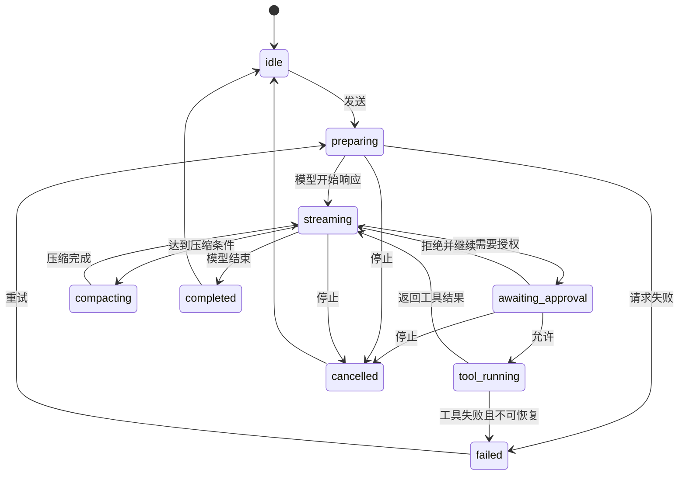

UI 不把“等待审批”误显示为“卡住”；该状态需要消息卡、标题栏和会话列表三处一致。

### 3.2 权限

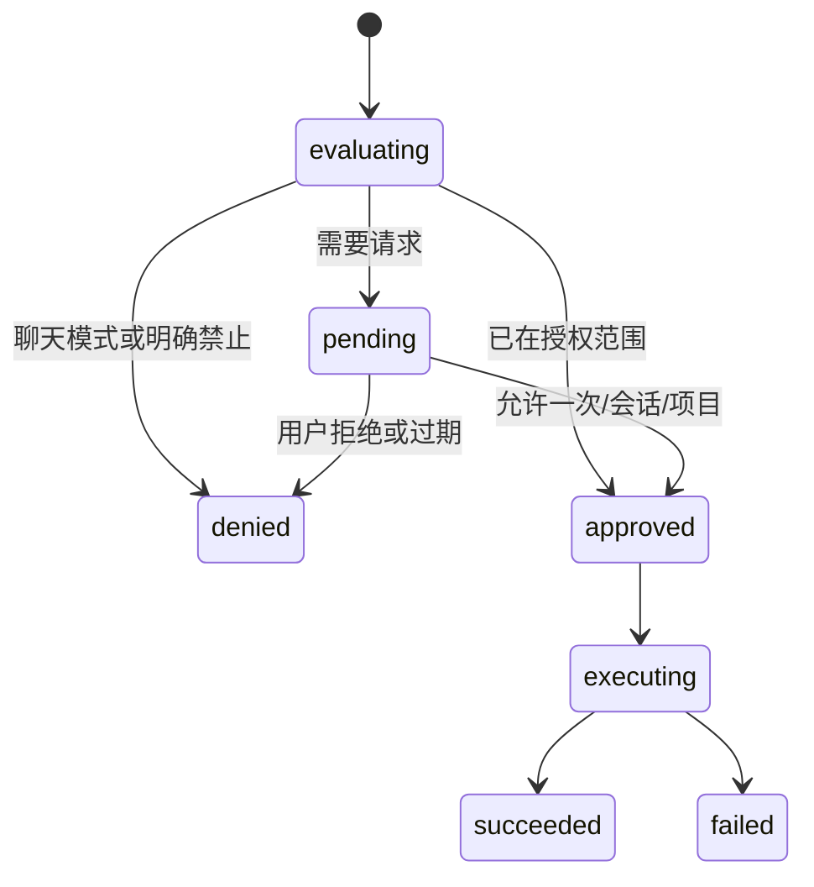

“绕过审批”只改变 `evaluating` 的策略，不隐藏工具动作、日志和结果。

### 3.3 文件页签

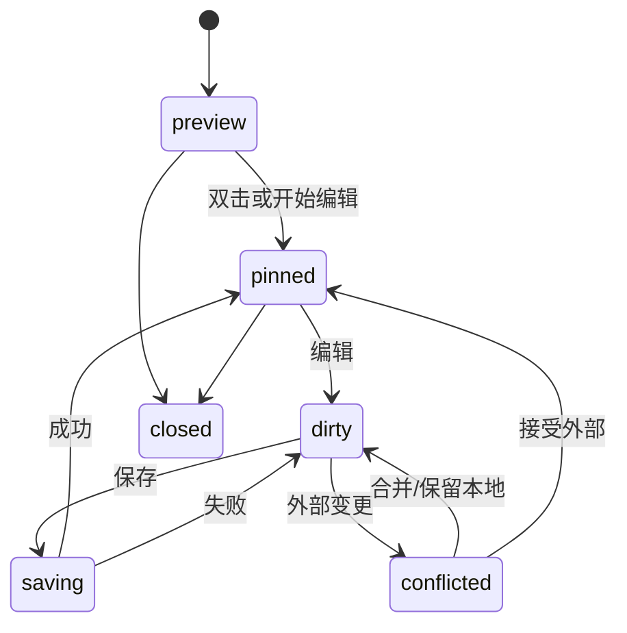

### 3.4 外部消息连接

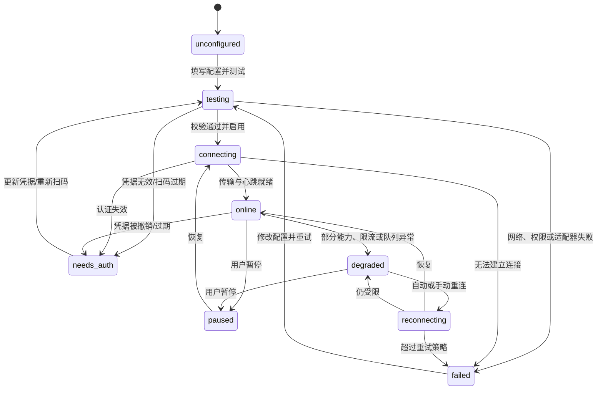

`online` 只描述渠道传输状态。每条入站事件仍需独立经过访问策略、会话路由和代理审批；配对请求也有自己的 `pending → approved/rejected/expired` 状态，不能用连接在线状态代替授权状态。

### 3.5 聊天内容渲染与 UI 事件

聊天渲染使用 [12-聊天内容渲染与流式交互](./12-聊天内容渲染与流式交互.md) 定义的 UI 适配事件，不把它当作 Wails 后端协议：

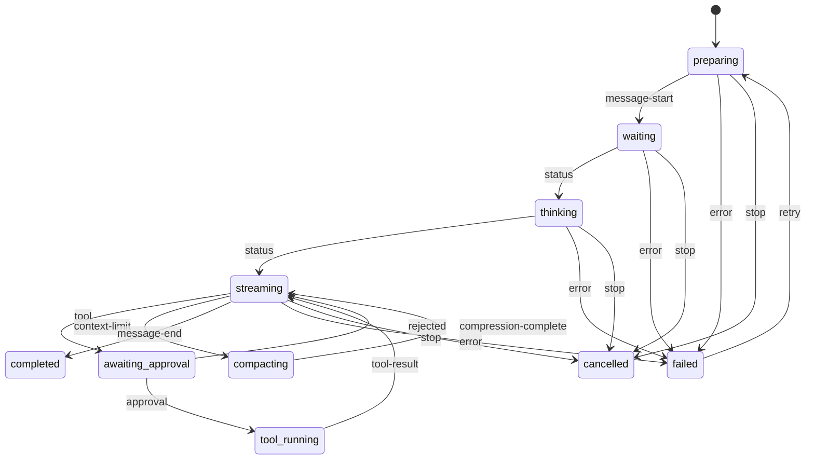

事件必须带稳定消息/内容块 ID；文本 delta 使用单调递增序号，重复事件不得重复追加。Zustand 只保存源文本、附件引用和状态，不保存解析后的 HTML、AST 或 SVG。活动状态由 `Marker` 表示，用户离开底部后 `MessageScroller` 不得强制移动阅读位置。

### 3.6 项目工作项

普通项目工作项与 `tasks` 定时任务分离，统一经过命令/策略层变更；笔记项目不创建或开放该状态域：

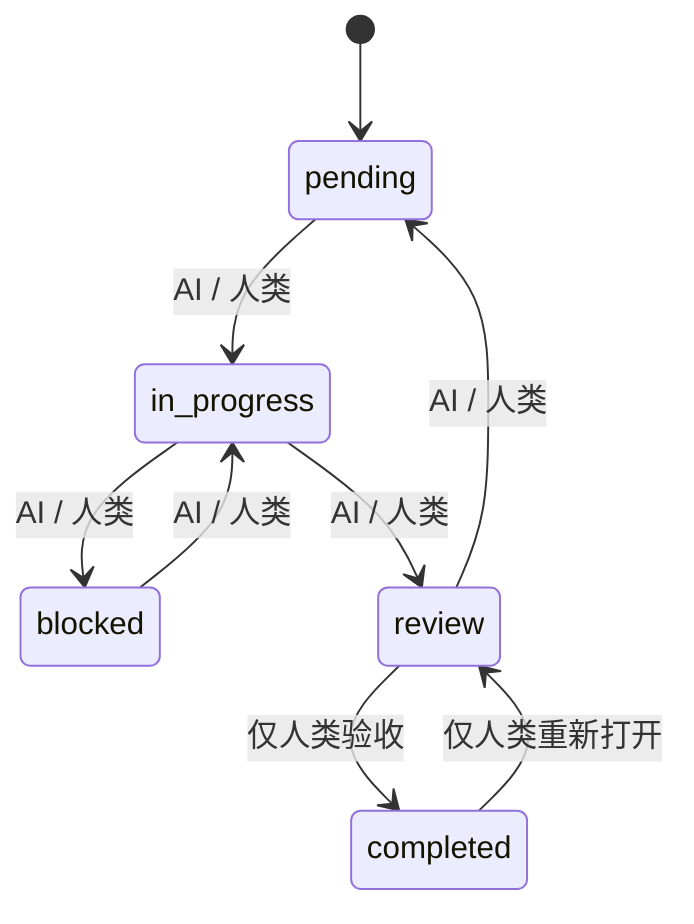

- 作废是独立 lifecycle，不是第六列；只有人类可作废和恢复。
- AI 尝试完成、重新打开、作废或恢复时必须拒绝并写入审计，不能静默更改状态。
- 主内容看板与右侧面板共享工作项/审计数据，但分别保存日期范围、视图、紧凑状态和选中任务。
- 日期筛选采用闭区间交集；未排期和已作废分别由独立开关控制。
- 前端可乐观更新普通移动并提供撤销；未来服务拒绝时必须回滚。

### 3.7 文档预览

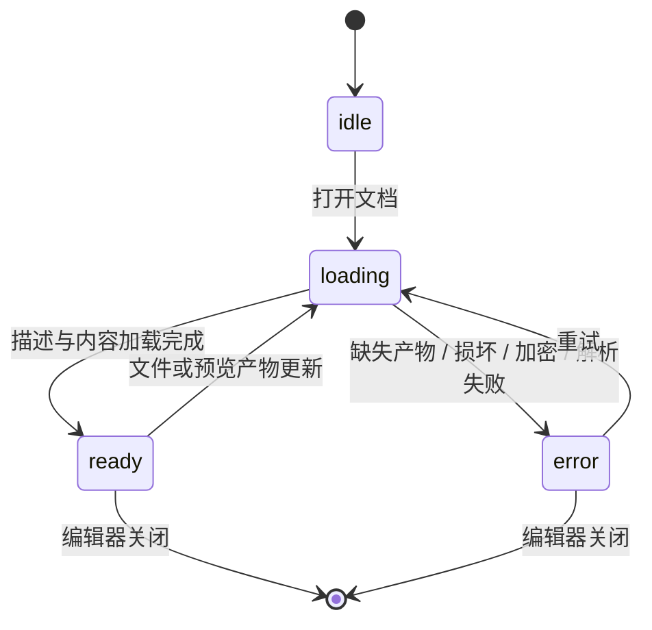

- 描述对象和工作簿清单由 `DocumentPreviewAdapter` 提供；展示组件不直接读取本地文件。
- 页面、缩放、导航、当前幻灯片和工作表状态以 `editorId` 隔离，同一文件的多个编辑器实例不得互相覆盖。
- 关闭编辑器、替换临时预览或跨组去重后清理孤立实例状态。
- PDF/Office 加载对象留在组件层并在卸载时释放，不进入 Zustand 持久化。

### 3.8 阅读订阅源

状态与详细语义见 [15-RSS阅读与智能合集](./15-RSS阅读与智能合集.md) §11.1：

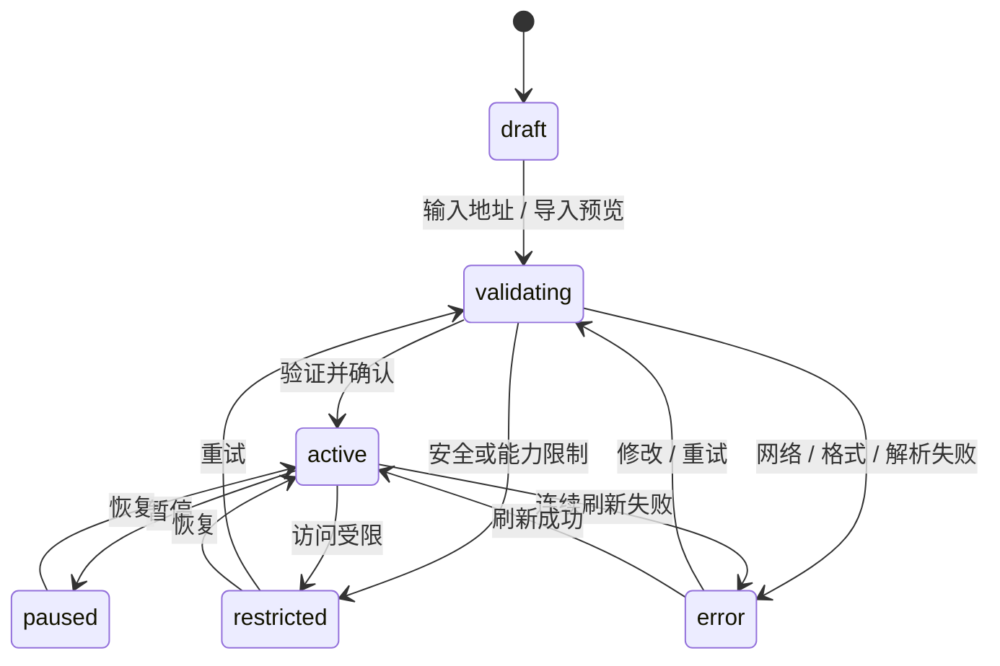

- 取消订阅是删除订阅关系的危险动作；默认保留历史文章，不把“已取消”伪装成仍会刷新的状态。
- 候选预览、订阅对象与阅读页状态分开，关闭添加向导不能污染现有订阅。
- UI-023 的状态变化只使用明确标记的样例，不声称完成真实 URL 验证或刷新。

### 3.9 阅读 AI 分类

每篇文章对精选和每个 AI 合集分别维护一条状态：

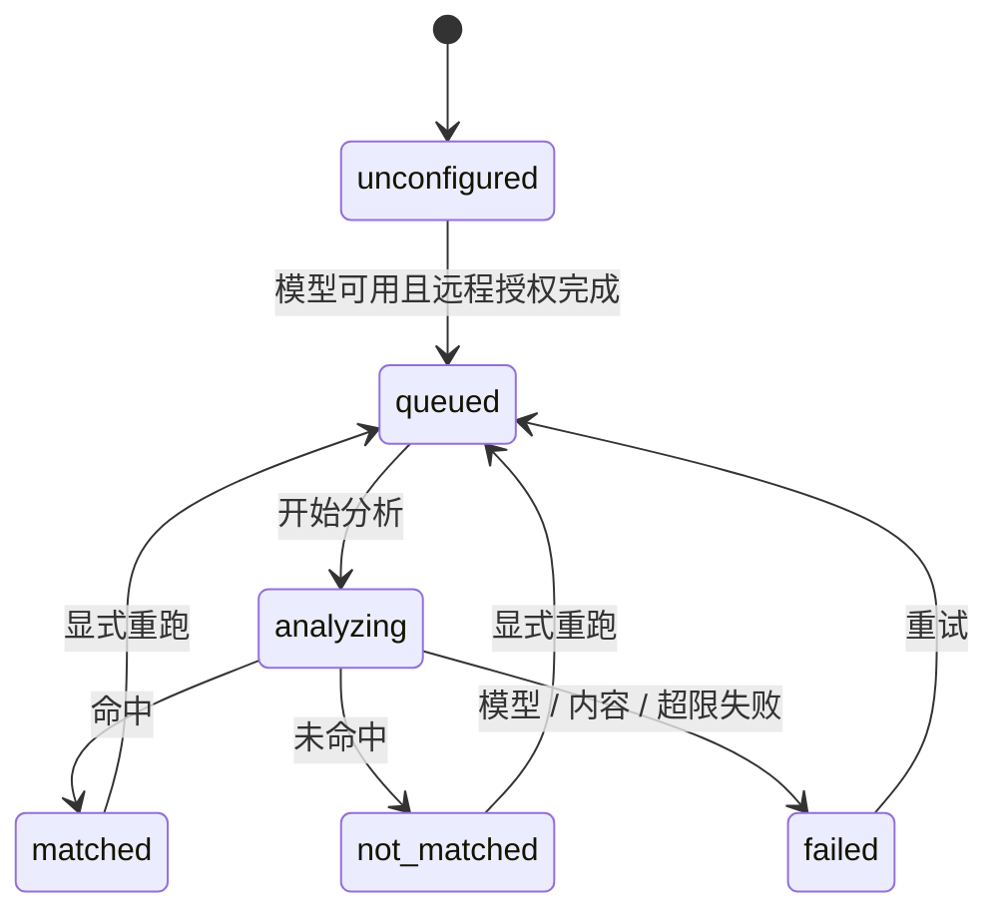

- `unconfigured` 必须区分模型缺失和远程未授权两个原因。
- AI 只决定当前合集是否命中，文章始终可在“全部”中按时间查看；分类状态不承载排序。
- 修改模型、文字要求或反馈规则不自动重跑历史，必须由用户选择新文章或回溯范围后入队。
- “更符合/不符合”只新增当前合集的可撤销规则，不从已读、收藏、跳过或停留推断。

### 3.10 添加项目

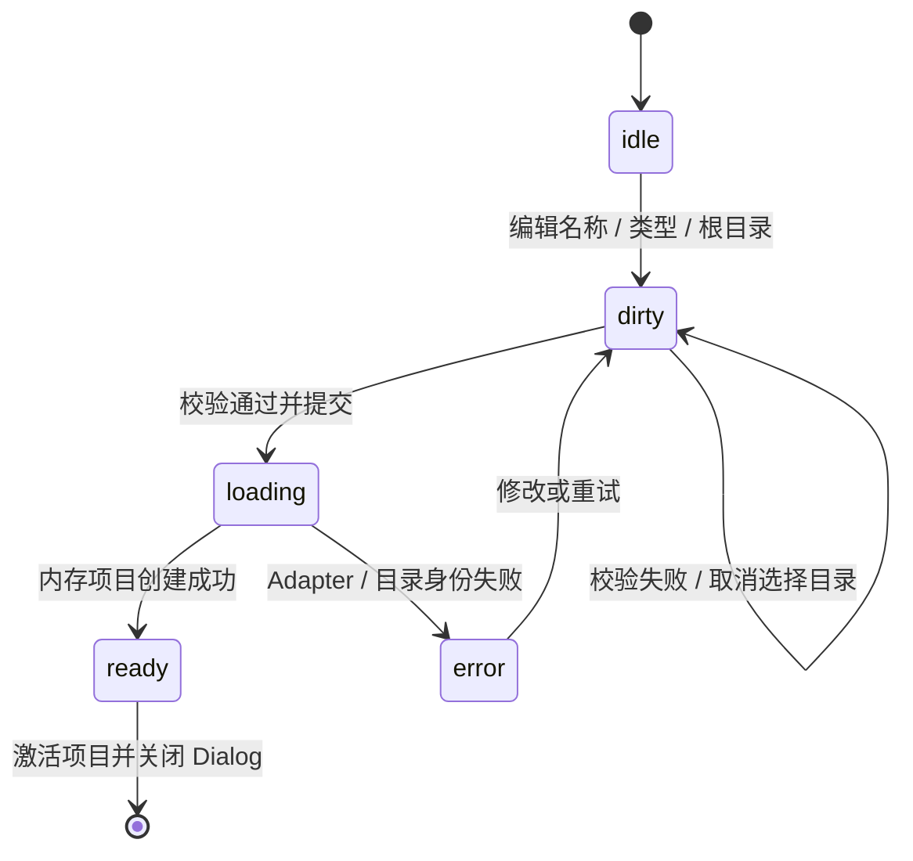

- 用户创建的“项目/笔记”类型创建后不可转换。
- 两类都至少一个根目录并指定唯一默认根目录；禁止重复路径和父子目录同时纳入。
- `ready` 在 UI-024 只表示内存对象就绪，不能描述持久化、扫描或索引完成。

### 3.11 笔记文件、编辑、索引与图谱

笔记域统一使用 `idle/loading/ready/dirty/partial/error` 词汇，但按对象裁剪可达状态：

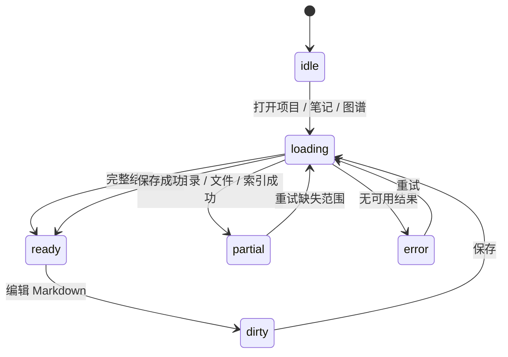

- 文件可用性可进入 `partial`；成功根目录保持可用，同时列出失效根目录。
- dirty 属于共享 Markdown Buffer；源码/并排/即时/预览模式、光标、选区和滚动按编辑器实例隔离。
- 图谱完整度不能高于其索引快照；索引 `partial` 时图谱也必须标记 `partial`。
- 所有请求携带项目 ID、请求 ID 和版本，切换项目或编辑后到达的旧结果不得覆盖新状态。
- 图谱只接受显式 Markdown 链接和 `[[WikiLink]]` 边；歧义与未解析目标进入状态摘要，不创建推测节点/边。

## 4. UI 与后端边界

| UI 动作 | UI 立即状态 | 未来能力边界 |
| --- | --- | --- |
| 发送消息 | 草稿锁定、生成占位消息 | `message-start`、`message-delta` 和模型流式事件 |
| 工具审批 | pending → decided | 权限服务和执行器 |
| 添加项目 | 表单校验、真实原生目录选择、内存项目 ready | 项目持久化、目录身份存储与恢复 |
| 选择多个根目录 | 暂存 Item 列表、默认根目录、重复/父子冲突反馈 | `ProjectFolderPickerAdapter` 规范路径身份；不扫描目录 |
| 打开文件 | 页签 Skeleton | 文件元数据/内容读取 |
| 打开笔记 | Vditor 动态加载、四模式页签和示例 Buffer | `NoteWorkspaceAdapter` 文件读取、版本与监听 |
| 预览 PDF/Office | loading → ready/error，状态按编辑器实例隔离 | Wails 文档读取、Office 转换、缓存与版本服务；首版只用仓库样例产物 |
| 保存文件 | dirty → saving | 原子写入与冲突检测 |
| 保存/移动/删除笔记与素材 | dirty/loading/Mock ready/error、危险确认 | 根目录内原子写入、冲突、废纸篓与审计；越界拒绝 |
| 加载大纲/反向链接/标签 | idle/loading/ready/partial/error 示例 | `NoteIndexAdapter` 解析、索引、增量更新与完整度 |
| 打开全局/局部图谱 | 动态加载画布、示例节点/边、筛选与状态 | 显式链接索引、消歧、图谱查询和 Cytoscape 布局 |
| 笔记代理文件/素材动作 | 审批、允许/拒绝与 Mock 结果 | 根目录策略、真实文件操作、内容/图片生成；禁止 Shell/执行 |
| 运行终端 | 启动 Spinner | PTY 生命周期 |
| 测试连接 | 分步 Progress | 数据库/HTTP 驱动 |
| 同步知识库 | 任务 Progress | 解析、嵌入、索引 |
| 安装 MCP/Skill | 审批后的步骤列表 | 下载、文件与进程 |
| 运行应用 | 权限检查 | 隔离 WebView/窗口 |
| 创建定时任务 | 本地校验成功 | 调度器持久化 |
| 创建/编辑项目工作项 | 内存工作副本与 Mock 审计 | `ProjectBoardService` 持久化与订阅 |
| AI 规划项目工作项 | 明确的 Mock 规划反馈 | `ProjectBoardPlanningAdapter` 读取项目并提交受策略约束的命令 |
| 验收/作废项目工作项 | AlertDialog 确认后更新 Mock | 人类身份、权限策略与审计持久化 |
| 测试外部消息连接 | testing + 分步 Progress | 平台认证、长连接/Webhook/Stream 与能力探测 |
| 批准渠道配对 | pending → approved/rejected | 稳定身份、允许列表与审计持久化 |
| 启停外部消息连接 | connecting/pausing/reconnecting | 本地后台服务、消息队列和渠道适配器生命周期 |
| 发现/添加 Feed | draft → validating，展示候选样例 | 安全 URL 发现、格式解析、重复识别与订阅持久化 |
| 刷新/暂停 Feed | 局部 Spinner 或状态切换 | 调度、HTTP 抓取、重试、限流与文章入库 |
| 导入/导出 OPML | 预览、逐项结果与明确 Mock 反馈 | 本地文件读写、解析、合并、部分提交和配置导出 |
| 标记已读/收藏 | 当前文章和跨合集投影同步更新 | 阅读库持久化、撤销与并发一致性 |
| 创建/编辑阅读合集 | 本地表单与匹配预览样例 | 合集持久化、成员投影与历史回溯任务 |
| AI 精选/归类 | unconfigured/queued/analyzing/matched/not_matched/failed 样例 | 模型适配、远程授权、队列、分类与理由持久化 |
| AI 反馈 | 当前合集规则样例 + 可撤销 Sonner | 反馈规则持久化与用户显式重跑 |
| 打开文章原文 | 保留当前文章并显示尝试状态 | 系统浏览器适配器与失败回执 |
| Mermaid 导出 | 格式选择、生成进度、Mock 完成反馈 | 后续文件服务生成并保存 SVG/PNG |
| 导出 | 格式与范围确认 | 文件生成与保存 |

当前 UI 实现阶段允许 mock：

- 列表数据。
- 状态切换。
- Toast/Sonner。
- Skeleton/Progress。
- 只读预览样例。
- 明确标记的 Feed 候选、OPML 结果和 AI 匹配预览样例。
- 内存项目、真实原生目录选择、多根目录校验和明确标记的笔记/图谱样例。
- Vditor/索引/图谱加载、保存、审批、partial 和失败的演示状态。

不得伪造：

- 真实网络连接成功。
- 真实模型费用结算。
- 真实文件写入。
- 真实终端命令执行。
- 真实 MCP/Skill 安装。
- 真实数据库向量同步。
- 真实外部渠道连接、扫码登录、消息接收/发送和远程任务成功。
- 真实 Feed 发现、网络刷新、OPML 文件读写、文章抓取/索引和取消订阅持久化。
- 真实远程/本地模型分类、质量验证、入选理由生成和个性化学习。
- 真实项目持久化、目录扫描/监听、笔记文件读写、链接索引、知识图谱计算和图片素材生成。
- 笔记项目中的 Shell、终端、构建、调试、可执行文件或项目看板动作。

## 5. 所有页面的状态清单

每个页面/详情层至少实现：

| 状态 | 验收问题 |
| --- | --- |
| 初始 | 用户是否知道当前页面与可做的第一件事？ |
| 空 | 是否说明为什么为空，并提供唯一推荐动作？ |
| 加载 | Skeleton 是否匹配最终结构且不大幅跳动？ |
| 部分加载 | 已有内容是否仍可使用？ |
| 成功 | 是否反馈完成并提供可撤销/定位动作？ |
| 校验错误 | Field 是否同时设置 `data-invalid` 与 `aria-invalid`？ |
| 运行错误 | 是否说明原因、影响与恢复动作？ |
| 离线 | 本地可用能力是否仍保持可用？ |
| 权限不足 | 是否说明缺少什么权限及如何处理？ |
| 禁用 | 是否解释禁用原因？ |
| 危险 | 是否用 AlertDialog 说明具体对象与后果？ |
| 超量 | 大文件、大结果、上下文、费用是否有上限与继续方式？ |

### 5.1 阅读专用状态

阅读页、阅读设置和相关浮层还必须覆盖：

- 无订阅、无文章、当前搜索无匹配、AI 合集零匹配四种不同 Empty。
- 网站发现多候选、重复订阅、验证中、源暂停、受限、错误和离线。
- OPML 预览、重复合并、部分失败、成功项保留和失败项重试。
- Feed 仅提供摘要、原文打开失败、发布时间缺失。
- 模型未配置、远程未授权、排队、分析、命中、不命中、部分失败和重试。
- 取消订阅默认保留历史与同时删除历史两种危险后果。
- 删除来源合集/AI 合集时明确“不删除文章或 Feed”。
- Mock 模式始终标明示例结果，不用成功提示伪造网络、文件或模型事实。

### 5.2 项目与笔记专用状态

- 添加项目的名称为空、未选类型、无根目录、默认根目录缺失、重复路径、父子目录重叠、目录失效和 Adapter 失败。
- 连续目录选择、取消选择、移除默认根目录和重新指定默认项。
- 普通项目/笔记项目切换时页签、编辑组、面板和尺寸各自恢复，非法跨类型面板被过滤。
- Vditor 首次加载、四模式切换、多个编辑组共享 Buffer、保存失败、外部冲突和实例销毁。
- 多根目录全部可用、部分可用、全部失败，以及同名笔记的唯一、歧义和未解析链接。
- 大纲无标题/解析中/错误；反向链接无结果/partial/error；Front Matter 缺失/合法/未知类型/解析失败。
- 图谱无笔记、有笔记无链接、筛选零结果、loading/ready/partial/error，以及键盘节点列表回退。
- 聊天模式工具拒绝；笔记代理根目录内允许、越界拒绝、符号链接逃逸拒绝、Shell/构建/调试/看板拒绝。
- UI-024 的目录选择、保存、索引、图谱和素材生成反馈始终说明真实能力是否尚未接入。

## 6. 响应式与平台验收

### 6.1 尺寸矩阵

| 场景 | 建议窗口 | 重点检查 |
| --- | --- | --- |
| 最小桌面窗 | 960 × 640 | 左侧栏可收、阅读列表/正文单页切换、笔记 split 让出侧栏/检查器空间、右侧 Sheet、输入框不溢出 |
| 标准笔记本 | 1280 × 800 | 两栏默认、阅读列表 + 阅读窗、普通项目底部终端、笔记右侧知识面板、管理页表格 |
| 标准大屏 | 1440 × 900 | 三栏、阅读/笔记 Resizable、消息宽度、面板拖拽、图谱节点列表 |
| 宽屏 | 1920 × 1080 | 主内容不过宽、阅读不形成第四列、笔记图谱不形成第四列、多模型比较、统计图 |
| 高 DPI | 150%/200% | 图标、1px 边框、Monaco、菜单定位 |

### 6.2 平台矩阵

| 平台 | 重点检查 |
| --- | --- |
| macOS | 红黄绿安全区、可拖拽标题栏、⌘ 快捷键、模板图标 |
| Windows | 系统窗口按钮、Ctrl 快捷键、缩放、通知权限 |
| Linux | 窗口装饰差异、字体回退、系统通知、文件管理器打开 |

## 7. 需求追踪矩阵

### 7.1 全局与布局

| 需求 | 设计位置 |
| --- | --- |
| 全局禁用原生右键 | [03](./03-全局交互与右键菜单.md) §2 |
| 不同区域不同右键、图标、快捷键、多级、分组 | [03](./03-全局交互与右键菜单.md) §3 |
| 默认两栏、至多三栏、分割面板 | [01](./01-视觉系统与窗口布局.md) §6–9 |
| 左侧栏三部分 | [02](./02-信息架构与导航.md) §3 |
| 项目默认收起、每次加载 5 个会话 | [02](./02-信息架构与导航.md) §3.2 |
| 固定“任务”项目 | [02](./02-信息架构与导航.md) §3.2 |
| 应用图标与无登录 footer | [02](./02-信息架构与导航.md) §3.3 |
| 独立标题栏与 macOS 红绿灯同一行 | [01](./01-视觉系统与窗口布局.md) §7 |
| 页面名称只在全局标题栏显示、内容区无双标题栏 | [01](./01-视觉系统与窗口布局.md) §7、[02](./02-信息架构与导航.md) §7 |
| 左/右/底栏按钮固定 | [01](./01-视觉系统与窗口布局.md) §7 |

### 7.2 新建任务与聊天

| 需求 | 设计位置 |
| --- | --- |
| 项目信息、分时古诗欢迎语 | [04](./04-代理与聊天.md) §2–3 |
| 两行至八行输入框 | [04](./04-代理与聊天.md) §4 |
| 加号完整菜单 | [04](./04-代理与聊天.md) §4.2 |
| 审批三档、智能体选择 | [04](./04-代理与聊天.md) §4.2 |
| 选项、上下文圆环、模型、发送 | [04](./04-代理与聊天.md) §4.3 |
| Slash 命令 | [04](./04-代理与聊天.md) §5 |
| 聊天模式禁用工具 | [04](./04-代理与聊天.md) §1 |
| 流式、工具调用、模型切换 | [04](./04-代理与聊天.md) §7–9 |
| 图片、文档、语音输入 | [04](./04-代理与聊天.md) §4、§6 |
| 记忆、网络搜索、知识库、工作流 | [04](./04-代理与聊天.md) §8 |
| Token 估算、上下文大小、自动压缩 | [04](./04-代理与聊天.md) §4.3、§10 |
| Markdown/GFM、安全 HTML、KaTeX、代码高亮 | [12](./12-聊天内容渲染与流式交互.md) §3–4 |
| Mermaid、图片、SVG/PNG 预览下载 | [12](./12-聊天内容渲染与流式交互.md) §4 |
| Markdown/HTML/PDF/Word 导出 | [04](./04-代理与聊天.md) §13 |
| 思考大纲 | [04](./04-代理与聊天.md) §7.2 |
| Marker 状态、UI 事件、唯一消息滚动区 | [12](./12-聊天内容渲染与流式交互.md) §2、§5–7 |
| 分叉、复制、重新生成、朗读 | [04](./04-代理与聊天.md) §11–12 |
| 多模型同时对话 | [04](./04-代理与聊天.md) §9 |
| 会话统计、花费、跨段计费 | [04](./04-代理与聊天.md) §10.3 |
| 临时会话 | [04](./04-代理与聊天.md) §11.2 |
| 重命名、删除、归档、搜索、Star | [04](./04-代理与聊天.md) §11.3 |

### 7.3 面板与文件

| 需求 | 设计位置 |
| --- | --- |
| 右侧更多：文件/终端/搜索/日志/会话调试 | [09](./09-工作区面板与文件预览.md) §1 |
| 空面板选择 | [09](./09-工作区面板与文件预览.md) §1.1 |
| 底栏默认终端、多 Tab、加号 | [09](./09-工作区面板与文件预览.md) §1.2 |
| 文件树 Material 图标与映射 | [09](./09-工作区面板与文件预览.md) §2 |
| 双击文件打开、中部多 Tab | [09](./09-工作区面板与文件预览.md) §2–3 |
| 聊天 Tab 不可关闭 | [02](./02-信息架构与导航.md) §5 |
| Monaco 编辑 | [09](./09-工作区面板与文件预览.md) §4 |
| 常见二进制预览 | [09](./09-工作区面板与文件预览.md) §5 |

### 7.4 管理功能

| 需求 | 设计位置 |
| --- | --- |
| 所有知识库类型与连接管理 | [05](./05-知识库与全局搜索.md) §4–8 |
| 全局功能/会话/聊天记录搜索 | [05](./05-知识库与全局搜索.md) §11 |
| AI 代码加入应用、创建/图标/编辑/多窗口 | [06](./06-应用中心.md) |
| MCP 手动/AI/市场、stdio/HTTP | [07](./07-能力中心.md) §2 |
| Skill CRUD/市场/AI/导入 | [07](./07-能力中心.md) §3 |
| 智能体工具/Skill/指令/Hooks/约束/placeholder | [07](./07-能力中心.md) §4 |
| 指令 CRUD 与注入 | [07](./07-能力中心.md) §5 |
| Hooks 完整生命周期 | [07](./07-能力中心.md) §6 |
| 定时任务时间选择与 Cron | [08](./08-任务与设置.md) §1 |
| 项目看板、五状态、人工验收、作废和只读甘特图 | [13](./13-项目看板与甘特图.md) |
| 全部模型供应商与多别名 | [08](./08-任务与设置.md) §3 |
| 统计图、贡献热力图、工具记录 | [08](./08-任务与设置.md) §4 |
| Telegram、飞书、Discord、钉钉、微信、QQ 外部消息连接 | [08](./08-任务与设置.md) §5 |
| 配对/允许列表、群组提及、会话路由与远程审批边界 | [08](./08-任务与设置.md) §5.4–5.8 |
| 通知、外观、字体、主题、动画 | [08](./08-任务与设置.md) §7–8 |
| 大量快捷键与自定义 | [08](./08-任务与设置.md) §9 |
| 关于 | [08](./08-任务与设置.md) §10 |

### 7.5 阅读与智能合集

| 需求 | 设计位置 |
| --- | --- |
| 左侧栏“阅读”位于“应用”下方，使用 `Rss` | [02](./02-信息架构与导航.md) §3.1、[15](./15-RSS阅读与智能合集.md) §3 |
| 文章列表 + 阅读窗与窄窗单页切换 | [15](./15-RSS阅读与智能合集.md) §4 |
| 仅精选/全部两个固定系统合集 | [15](./15-RSS阅读与智能合集.md) §2、§6.1 |
| 全部按时间、AI 不重排、重复逐篇保留 | [15](./15-RSS阅读与智能合集.md) §2、§5.2 |
| 来源合集与 AI 合集不可互换且可重叠 | [15](./15-RSS阅读与智能合集.md) §6 |
| AI 合集回溯范围、默认 30 天与匹配预览 | [15](./15-RSS阅读与智能合集.md) §6.3、§7.2 |
| 精选质量基线、模型判断提示与入选理由 | [15](./15-RSS阅读与智能合集.md) §7.1–§7.3 |
| 全局阅读模型、单合集覆盖与远程数据确认 | [15](./15-RSS阅读与智能合集.md) §7.4 |
| 显式、当前合集作用域、可撤销的反馈规则 | [15](./15-RSS阅读与智能合集.md) §7.5 |
| 公开 Feed 候选、OPML、取消订阅与历史保留 | [15](./15-RSS阅读与智能合集.md) §8.1 |
| 阅读设置四页签与三种打开/已读策略 | [08](./08-任务与设置.md) §6、[15](./15-RSS阅读与智能合集.md) §8 |
| Feed 正文/摘要边界和阅读页内搜索 | [15](./15-RSS阅读与智能合集.md) §5.3、§5.7 |
| Feed/AI 状态机、Mock 边界与抓取安全 | [15](./15-RSS阅读与智能合集.md) §11–§14 |

### 7.6 项目与笔记工作区

| 需求 | 设计位置 |
| --- | --- |
| “项目”标题行 Hover/键盘/无 Hover 加号 | [16](./16-项目与笔记工作区.md) §4.1 |
| 添加项目名称、不可转换类型和多根目录表单 | [16](./16-项目与笔记工作区.md) §4.2–§4.4 |
| 重复路径、父子目录和默认根目录校验 | [16](./16-项目与笔记工作区.md) §4.4 |
| 项目/笔记主内容、右侧、底部与代理能力矩阵 | [16](./16-项目与笔记工作区.md) §5、§11–§12 |
| 按项目隔离页签、编辑组、面板与尺寸快照 | [16](./16-项目与笔记工作区.md) §6 |
| Vditor 源码/并排/即时/预览四模式 | [16](./16-项目与笔记工作区.md) §3、§7 |
| 多编辑组共享 Markdown Buffer、独立视图 | [16](./16-项目与笔记工作区.md) §7.1–§7.3 |
| 多根目录文件树、Markdown 编辑与素材安全预览 | [16](./16-项目与笔记工作区.md) §8 |
| 大纲、反向链接、标签与 YAML 属性 | [16](./16-项目与笔记工作区.md) §9 |
| 全局/局部图谱、显式链接边与多根目录消歧 | [16](./16-项目与笔记工作区.md) §10 |
| 笔记代理根目录白名单和 Shell/执行/看板拒绝 | [16](./16-项目与笔记工作区.md) §12 |
| 状态、Adapter、Zustand 排除项和 UI-024 Mock 边界 | [16](./16-项目与笔记工作区.md) §13–§14 |

## 8. 分阶段实施建议

本节仅用于后续拆分，不代表本轮开始编码。

### 阶段 0：基础

- Tailwind/shadcn token。
- 字体。
- 图标资源和映射。
- 指定组件安装与 registry 验证。
- 全局状态/路由骨架。

### 阶段 1：应用外壳

- 标题栏、Sidebar、Resizable。
- 项目/会话。
- Command。
- 全局 ContextMenu。
- 右侧/底部空面板。

### 阶段 2：代理与聊天

- 新建任务。
- 输入框。
- 消息/Markdown/KaTeX/Mermaid/代码高亮。
- MessageScroller/Marker 流式/工具/审批状态。
- 上下文、统计、多模型和会话管理。

### 阶段 3：文件与面板

- 文件树、Material 图标。
- 文件页签、Monaco、预览。
- 终端/搜索/日志/调试面板。

### 阶段 4：管理页面

- 知识库。
- 应用。
- 能力。
- 定时任务。
- 项目看板与甘特图。

### 阶段 5：设置与质量

- 模型、统计、外部消息连接、通知、外观、快捷键、关于。
- 全状态、可访问性、平台与尺寸验收。

### 阶段 6：阅读

- DOC-006 用户评审通过后再启动 UI-023。
- 先实现阅读入口、文章列表/阅读窗、两类合集、设置四页签与完整 Mock 状态。
- 继续使用明确样例，不接真实 Feed、OPML、文章索引、模型或 Wails 业务协议。
- 前端 Mock 验收通过后，另建抓取/存储/分类后端设计与安全评审任务。

### 阶段 7：项目与笔记工作区

- DOC-007 用户评审通过后再启动 UI-024。
- 先实现项目标题行加号、添加项目 Dialog、内存双类型项目、真实原生目录选择和类型专属工作区 Mock。
- 笔记编辑与图谱依赖必须本地安装并动态加载；先验证 Vditor React 生命周期、四模式和 Cytoscape 可访问列表，再扩展知识面板。
- UI-024 不接项目持久化、目录扫描、真实文件读写、链接索引、图谱计算或图片生成。
- 真实文件/索引/生成服务开始前，另建根目录安全、符号链接、并发写入、链接消歧和性能评审任务。

## 9. 实现前置依赖

以下事项不阻塞设计，但阻塞高保真实现：

1. 补齐三个应用图标资源。
2. 补齐 `frontend/src/assets/icons/material/`。
3. 创建并确认 `docs/文件图标映射.md`。
4. 核对当前 shadcn registry 中 AI 组件的实际名称与 API。
5. 确定 Monaco、终端、PDF/Office/媒体预览的实现库。
6. 明确 Wails 各平台无边框标题栏、拖拽区和多窗口约束。
7. 明确模型、知识库、MCP、Skill、任务调度的后端数据契约。
8. 明确六类外部消息渠道的适配器来源、官方 API/连接器合规性、本地后台服务、凭据存储、事件去重和消息队列契约。
9. 设计文档 12 审核通过后再安装 Markdown、KaTeX、Mermaid、Shiki、sanitize 与聊天 shadcn 组件依赖；Mermaid/Shiki 应动态分包，避免扩大首屏主包。
10. DOC-006 通过用户评审后才能启动 UI-023；UI-023 只做前端 Mock，不得顺带设计或实现 Go 抓取器。
11. 真实阅读后端开始前，明确 Feed 安全抓取、重定向/SSRF 防护、响应上限、恶意 XML/JSON/HTML、文章存储/留存、OPML 文件与 AI 分类队列契约。
12. 远程阅读模型开始前，明确供应商数据策略、披露版本、授权撤销、发送字段最小化和文章提示注入隔离。
13. DOC-007 通过用户评审后才能启动 UI-024；Vditor 与 Cytoscape.js 只使用本地 npm 资源和动态分包，不使用 CDN。
14. 真实笔记服务开始前，明确多根目录规范身份、符号链接/越界防护、文件监听与冲突、Markdown/WikiLink 索引和重名消歧契约。

## 10. 最终 UI 验收清单

- [ ] 启动后默认进入“任务”项目的新建任务页。
- [ ] 左侧栏默认展开，三段结构与收起状态完整。
- [ ] 标题栏在所有页面保持单行和固定控制位置。
- [ ] 当前页面、会话或文件名称只在全局标题栏出现；内容区没有重复同名主标题或第二条页面标题栏。
- [ ] 主区默认两栏，可展开右侧形成三栏，底部可独立分割。
- [ ] 所有区域不再出现浏览器原生右键菜单。
- [ ] 右键菜单项均有图标；有快捷键则显示；长菜单有分组和子菜单。
- [ ] 聊天模式无法触发任何工具或副作用能力。
- [ ] 代理流式、工具、审批、失败、取消、压缩和完成状态可辨识。
- [ ] 聊天支持 GFM Markdown、KaTeX、代码高亮和 Mermaid 源码/预览/Mock 导出。
- [ ] 危险 HTML、事件属性、危险链接协议和 Mermaid 外部资源不会执行。
- [ ] 流式 delta 只追加、不重复；用户上滑后不会被自动滚动抢回。
- [ ] 聊天只有一个主要消息滚动容器，支持未读数量和回到最新消息。
- [ ] 所有功能页面有空、加载、错误、成功和禁用状态。
- [ ] 每个普通项目的工作项互相隔离；主看板与右侧看板共享数据但不共享筛选/选中状态，笔记项目不提供看板。
- [ ] 看板五列、列内排序、跨列移动、空列放置和键盘拖放可用；右侧窄面板退化为单状态列。
- [ ] AI 不能完成、重新打开、作废或恢复项目工作项；只有人类可从待验收进入已完成。
- [ ] 甘特图按天展示跨月、单日、周末、今日线和未排期分组，不支持首版范围外的依赖与拖动改期。
- [ ] 文件双击打开持久页签；聊天页签无法关闭。
- [ ] “项目”标题行加号只在 Hover 时弱化展示，同时键盘聚焦与无 Hover 设备始终可用。
- [ ] 添加项目支持不可转换的项目/笔记类型、多个根目录、唯一默认目录，并拒绝重复与父子目录重叠。
- [ ] 普通项目和笔记项目的主内容、右侧栏、底部面板和代理能力严格按类型裁剪，切换项目不串状态。
- [ ] 笔记源码、并排、即时、预览四模式位于同一页签；多个编辑组共享 Buffer 但独立保存视图。
- [ ] 笔记文件面板覆盖多根目录、新建、重命名、移动、复制路径和废纸篓状态；只有 Markdown 可编辑。
- [ ] 大纲、反向链接、标签与属性覆盖空、加载、partial、错误和定位状态。
- [ ] 全局/局部图谱只显示显式 Markdown/WikiLink 关系，支持消歧、筛选、键盘节点列表和空/加载/partial/错误状态。
- [ ] 聊天模式拒绝全部工具；笔记代理允许审批后的根目录内文件/素材动作，但拒绝越界、Shell、构建、调试、执行和项目看板。
- [ ] UI-024 不把真实目录选择伪装成项目持久化、目录扫描、文件写入、索引、图谱计算或图片生成完成。
- [ ] 文件图标严格按映射，未知类型有稳定回退。
- [ ] 常见文本、媒体、Office、压缩包和未知二进制有安全预览路径。
- [ ] Command 可搜功能、会话和聊天记录。
- [ ] Command 可打开阅读并导航合集；文章正文仍只在阅读页内搜索。
- [ ] 左侧栏“阅读”紧贴“应用”下方，系统合集只有精选/全部。
- [ ] 阅读标准窗使用文章列表 + 阅读窗，窄窗单页切换；合集选择器不形成第四列。
- [ ] 全部和所有合集按发布时间倒序，AI 不重排，重复报道逐篇保留。
- [ ] 来源合集和 AI 合集创建字段互斥、类型不可转换，来源与文章可重叠归组。
- [ ] 精选/AI 合集显示模型判断提示、入选理由和当前合集作用域的可撤销反馈。
- [ ] 远程模型首次用于阅读前披露发送正文/摘要、元数据和要求，并明确不发送 Feed 凭据。
- [ ] OPML 预览、重复合并、部分失败、标准导出与 Aestival AI 配置导出边界清晰。
- [ ] 取消订阅默认保留历史，也能明确选择同时删除；摘要正文提示并提供打开原文。
- [ ] UI Mock 不伪造 Feed 发现/刷新、OPML 文件操作、文章抓取或 AI 分类成功。
- [ ] 设置中可配置 Telegram、飞书、Discord、钉钉、微信和 QQ；每个平台显示真实连接方式、能力与限制。
- [ ] 外部消息连接默认私聊配对、群组禁用；启用群组后默认允许列表并要求提及。
- [ ] 外部来源按平台、连接、发送者、群组和话题隔离会话，重复事件不会重复执行有副作用动作。
- [ ] 远程请求不能改变或绕过审批；高风险授权、删除和扩大权限只能在桌面端完成。
- [ ] 渠道凭据、扫码会话、消息正文和稳定身份不会进入普通 Zustand、未脱敏日志或配置导出。
- [ ] 破坏性动作全部使用 AlertDialog。
- [ ] 图标按钮均有 `aria-label` 与 Tooltip。
- [ ] 页面不存在 Card 套 Card，也不存在边框/圆角容器模拟的视觉卡片嵌套。
- [ ] Card 仅用于独立对象或预览；主要页面没有退化为卡片墙，列表、表格、Item 和普通分区被优先使用。
- [ ] 键盘可完成导航、菜单、对话、文件和设置主要流程。
- [ ] 960×640、1280×800、1440×900、1920×1080 无横向溢出或不可恢复面板。
- [ ] macOS、Windows、Linux 的窗口控制和快捷键显示正确。
- [ ] UI 中无登录、注册、云账户头像或虚构用户身份入口。
