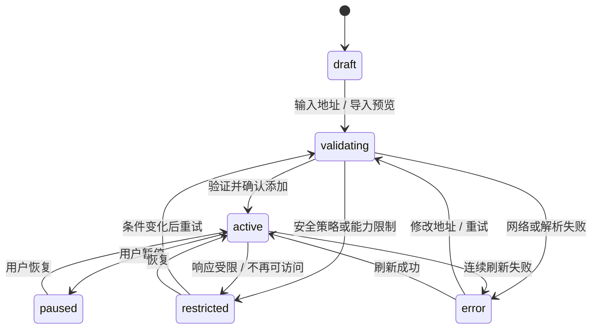
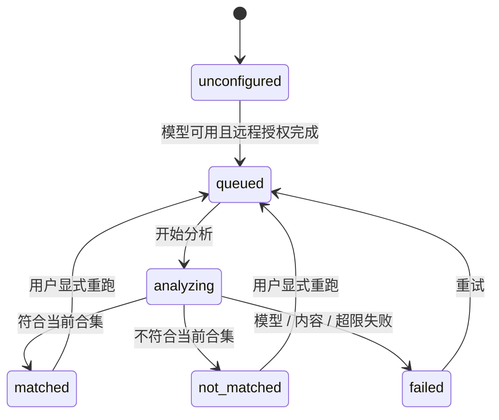

# RSS 阅读与智能合集

> 任务：DOC-006
> 版本：0.2
> 日期：2026-08-11
> 状态：用户已通过；UI-023 已实现并待验收
> 边界：作为前端 Mock 与必要 UI 交互适配的实现基线；不接真实 Feed 抓取、OPML 文件读写、模型分类或持久化

调研依据与证据分层见 [RSS 阅读与智能合集需求调研](../需求调研/RSS阅读与智能合集.md)。

## 1. 目标与范围

### 1.1 目标

1. 在 Aestival 左侧栏提供稳定的“阅读”入口，让用户订阅公开 RSS、Atom 与 JSON Feed。
2. 同时提供可信的完整时间线和可解释的 AI 降噪视图，不让 AI 改变时间排序或暗中隐藏原始来源。
3. 用两种清晰、不可互换的自定义合集满足“按来源分组”和“按内容要求自动归类”。
4. 让 Feed 添加、OPML 迁移、失效恢复、取消订阅与历史保留具有明确结果和错误状态。
5. 让远程模型发送范围、文章入选理由和用户反馈规则可见、可撤销、可审计。
6. 保持 Aestival 本地优先、无登录、紧凑桌面 UI、shadcn/ui 组件层和诚实 Mock 边界。

### 1.2 首版不包含

- 私有或需要 Basic Auth、Cookie、Token、客户端证书的 Feed。
- 把普通网页自动转换为 Feed。
- 网页全文抓取、Readability 提取、嵌入原网页或执行网页脚本。
- 播客播放、音视频进度、章节与队列等专项体验。
- 相似报道聚类、自动去重、折叠或隐藏。
- 通用自动化规则、Webhook、邮件转发或第三方导出动作。
- 基于打开、停留、跳过、滚动、收藏等行为的隐式个性化。
- 真实 Feed 发现、网络刷新、文件导入导出、模型调用、持久化或 Go 抓取器。

## 2. 产品原则与不可变约束

| 编号 | 约束 |
| --- | --- |
| R-01 | 系统固定合集只有“精选”和“全部”，始终排在自定义合集之前，不可重命名、删除或重排。 |
| R-02 | “全部”包含所有订阅文章以及取消订阅后选择保留的历史文章。 |
| R-03 | “精选”从全部来源中按质量基线与用户要求筛选；这是模型判断，不是事实正确性保证。 |
| R-04 | 所有合集按文章发布时间倒序；AI 只决定是否入选，不改变排序。发布时间缺失时使用接收时间作为明确标注的回退。 |
| R-05 | 相似或重复报道逐篇保留，不聚合、不折叠、不隐藏。 |
| R-06 | 订阅源可同时属于多个来源合集，文章可同时属于多个来源合集和多个 AI 合集。 |
| R-07 | 来源合集只按用户选择的一个或多个 Feed 收录其全部文章，不做内容筛选。 |
| R-08 | AI 合集不选择来源，只按自然语言要求分析全部活跃订阅的新文章。 |
| R-09 | 阅读、收藏、跳过和停留时长不会暗中训练模型；只有用户显式反馈会生成规则。 |
| R-10 | 用户文字要求保持原文；AI 反馈规则单独保存、可查看、可撤销，不静默改写原要求。 |
| R-11 | 设置是订阅源与合集的唯一完整管理面；阅读页只提供日常阅读和快捷入口。 |
| R-12 | 页面名称“阅读”只显示在全局标题栏，内容区不得再出现同名主标题或第二条页面标题栏。 |

## 3. 入口、导航与恢复

### 3.1 左侧栏

- 在现有“应用”菜单正下方新增“阅读”，使用 Lucide `Rss`。
- 其他菜单相对顺序保持不变：新建任务、知识库、应用、阅读、能力、任务。
- 收起侧栏时只显示 `Rss` 图标，必须有 `aria-label="阅读"` 与 Tooltip。
- 当前位于阅读页时使用标准 Sidebar 选中态；未读数字只有在用户未隐藏时才显示，数值为当前合集的未读数。
- 合集不展开到全局侧栏，避免侧栏承担第四层导航；合集选择器位于文章列表区域。

### 3.2 其他入口

- 全局 `Command` 增加“打开阅读”，并可按合集名称导航到“阅读 / 合集名”。
- 阅读页工具栏提供“添加订阅”和“管理阅读”快捷入口；两者分别打开设置的“阅读 / 订阅源”和“阅读 / 合集”。
- 设置页的“阅读”分类是完整管理入口。
- 文章正文、文章标题或链接不加入本轮全局内容搜索索引；正文搜索只在阅读页内工作。

### 3.3 导航历史与恢复

- 打开阅读页、切换合集、进入整页阅读、打开阅读设置进入应用内部历史。
- 列表中选择另一篇文章只更新当前阅读定位，不为每次选择堆叠历史；整页阅读的文章切换可进入历史。
- 重启后可恢复最后选择的合集、列表滚动锚点和安全的文章 ID；不把远程模型正文、临时导入文件或未提交表单恢复到普通路由状态。
- 如果文章已删除或合集不存在，回退到“全部”并用 Sonner 说明恢复结果。

## 4. 阅读页布局

### 4.1 标准与宽窗口

阅读页主内容使用 `Resizable` 组成“文章列表 + 阅读窗”。全局左侧栏已经占据第一列，因此合集选择器必须并入文章列表，不能再增加独立合集列。

- 标准宽度建议：文章列表 320–440px，阅读窗占剩余宽度；用户调整比例后本地记忆。
- 列表和正文各自是明确滚动表面，但正文内不得再嵌套多个竞争的纵向滚动容器。
- 列表顶部是普通工具区，不创建带背景/底边的第二条页面标题栏。
- 打开全局右侧工作区面板时，不允许形成“Sidebar + 列表 + 阅读窗 + 右栏”四列；右栏在阅读页以覆盖 Sheet 呈现，或先切换为单内容面再显示。
- 底部面板仍可作为垂直分割打开，但要保留列表与正文的最小高度和恢复入口。

### 4.2 窄窗口

在 960–1199px 或内部主内容不足以同时保证列表与正文最小宽度时，阅读页退化为单内容面：

1. 默认显示文章列表。
2. 打开文章后切到正文页，标题栏名称仍为“阅读”。
3. 正文顶部提供“返回列表”，返回后焦点恢复到原文章行并保持滚动位置。
4. 合集选择、搜索和批量动作只在列表页出现；正文保留文章级动作。
5. 详情菜单或设置表单使用 `Drawer`/`Sheet`，不得横向溢出。

### 4.3 整页阅读

“整页阅读”使用主内容全部可用宽度呈现当前文章，隐藏文章列表但保留返回入口；这不是新的主内容页签，也不复制页面名称。返回后恢复原合集、筛选、选中行和滚动位置。

## 5. 阅读页结构与交互

### 5.1 列表工具区

从上到下包含：

1. 合集选择器：`Combobox`/`Popover + Command`，系统合集固定在首组，自定义合集在第二组。
2. 本地搜索：搜索当前合集已加载文章的标题、作者、来源和 Feed 提供的正文/摘要。
3. 筛选：`ToggleGroup` 提供“全部文章 / 未读 / 收藏”；可追加来源筛选，但排序固定不可切换。
4. 动作：刷新状态、添加订阅、管理阅读和更多菜单；真实刷新未实现时必须显示“UI 演示”边界。
5. 批量工具栏：勾选文章后出现“标记已读/未读”“收藏/取消收藏”和“清除选择”。

合集选择器摘要显示合集名称、类型图标和可选未读数：

| 合集类型 | 图标 | 辅助说明 |
| --- | --- | --- |
| 精选 | `Sparkles` | AI 按质量与口味筛选 |
| 全部 | `List` | 所有文章的时间线 |
| 订阅源合集 | `FolderInput` | 明确来源集合 |
| AI 合集 | `WandSparkles` | 按文字要求自动归类 |

### 5.2 文章列表

文章列表使用 `Item`/普通列表行与 `Separator`，不为每篇文章创建 Card。每行可展示：

- 未读圆点与选择 Checkbox。
- 标题，最多两行。
- 来源名称、作者、发布时间。
- Feed 自带缩略图（存在且安全时）；缺失时不放占位框。
- 收藏状态。
- 当前为精选或 AI 合集时的一行简短入选理由入口。
- 分类分析中、失败或摘要正文等必要 Badge。

交互规则：

- 单击或 `Enter` 按默认打开方式处理文章。
- 选中态、Hover、键盘焦点与未读态必须能独立辨识，不能只靠背景颜色。
- 所有合集按 `publishedAt` 倒序；发布时间相同使用 `receivedAt`、稳定文章 ID 保证顺序稳定。
- `publishedAt` 缺失或无效时按 `receivedAt` 排序，并显示“发布时间缺失，按接收时间”。
- 相同 URL、相同标题或语义相似的文章仍逐行显示；不出现“已合并 N 篇”。
- 列表虚拟化属于实现优化，不能破坏键盘顺序、选区、焦点恢复或批量选择。

### 5.3 阅读窗

正文由 `Typography` 与安全内容渲染器承载：

- 显示文章标题、来源、作者、发布时间、原文域名和阅读状态。
- 只展示 Feed 提供的正文或摘要；不在首版抓取网页全文。
- 当 Feed 只提供摘要时，在正文前显示持续 `Alert`：“此订阅源只提供摘要”，并提供“打开原文”。
- 图片只加载 Feed 正文中允许的安全资源；失败时显示可读替代说明，不用占位图伪装。
- Feed HTML 必须经过安全清洗；脚本、事件属性、表单、iframe、危险协议和外部样式不得执行。
- 正文可选择和复制，不能继承应用外壳的禁选规则。
- AI 入选理由是正文前的可折叠说明区，包含作用合集、可观察依据和模型判断提示，不展示或伪造完整思维链。

正文工具栏提供：

- 标记已读/未读。
- 收藏/取消收藏。
- 复制链接。
- 按默认方式之外临时选择“列表 + 阅读窗 / 整页阅读 / 打开原文”。
- 当前属于精选或 AI 合集时，提供“更符合”“不符合”。
- 更多菜单和对应文章右键菜单。

### 5.4 三种打开方式

| 方式 | 行为 | 适用场景 |
| --- | --- | --- |
| 列表 + 阅读窗 | 在当前列表右侧显示 Feed 正文/摘要 | 默认；连续扫读 |
| 整页阅读 | 主内容切换为单文章正文，提供返回列表 | 长文与窄窗口阅读 |
| 直接打开原网页 | 调用系统默认浏览器打开规范化文章 URL | Feed 只给摘要或用户偏好网页 |

- 全局默认值位于“设置 / 阅读 / 阅读偏好”。
- 每篇文章的菜单始终可临时选另外两种方式，不改全局默认。
- 外部打开失败时保留当前文章并显示可复制 URL 与重试，不声称已经打开。

### 5.5 已读与未读

已读触发有三种互斥策略：

1. 打开时标记，默认。
2. 阅读窗滚动到底时标记。
3. 仅手动标记。

规则：

- 设置改变只影响后续操作，不批量改写历史。
- “滚动到底”需达到正文末尾的可访问锚点，不以停留时长猜测。
- 直接打开原网页时，“打开时”策略可标记已读；其他策略保持原状态。
- 用户可随时改回未读。
- 未读数字可全局隐藏；隐藏数字不删除已读状态，未读筛选仍可用。
- 批量标记已读必须显示影响数量并提供短时撤销。

### 5.6 收藏

- 收藏是文章布尔状态，可跨合集显示并作为筛选条件。
- 收藏不是第三个系统合集，不能与“精选”“全部”并列。
- 同一文章无论从哪个合集收藏，状态在所有合集一致。
- 取消订阅并保留历史时收藏仍保留；选择删除历史时收藏随文章删除，并在确认中说明。

### 5.7 阅读页内搜索

- 搜索范围是当前合集中的本地文章数据：标题、作者、来源、Feed 正文或摘要。
- 搜索结果仍按发布时间倒序，不使用相关度重排；匹配摘要只用于定位。
- 搜索为空时区分“合集本身无文章”和“当前关键词无匹配”。
- 首版不将文章正文写入全局 Command 索引；全局 Command 只导航到阅读页和合集。

## 6. 合集模型

### 6.1 系统合集

#### 精选

- ID 稳定，名称固定为“精选”。
- 分析全部活跃订阅的新文章；取消订阅但保留历史时，已产生的精选匹配记录继续保留。
- 只展示 `matched` 的文章，按发布时间倒序。
- 分类排队或失败不会让文章从“全部”消失；精选工具区显示待分析和失败数量。
- 用户可在设置写入全局口味要求、选择默认模型、查看和撤销精选反馈规则。

#### 全部

- ID 稳定，名称固定为“全部”。
- 展示所有活跃订阅文章，以及取消订阅时选择保留的历史文章。
- 不依赖模型配置或远程授权；AI 不可用时仍完整可读。
- 收藏、未读、来源和本地搜索只是筛选，不改变合集定义。

### 6.2 订阅源合集

创建要求：

- 选择一个或多个现有订阅源，至少一个。
- 设置名称；名称不可与同层已有合集完全重复。
- 保存后立即包含这些来源的全部已有文章，后续新文章自动进入。

行为：

- 一个来源可属于多个订阅源合集。
- 文章因来源关系进入合集，不经过 AI；不会展示 AI 入选理由或反馈按钮。
- 可重命名、调整来源、在自定义合集区域重排或删除。
- 取消订阅并保留历史时，既有文章保留其来源合集快照，不再产生新文章；删除历史时从所有合集移除。
- 类型不可改为 AI 合集；需要另一类型时新建合集。

### 6.3 AI 合集

创建要求：

- 不显示来源选择器，也不接受来源限制。
- 设置名称与自然语言分类要求，例如“有可复现实验数据、面向工程实践的本地 AI 文章”。
- 可使用全局阅读模型，或显式覆盖为另一个已配置模型。
- 选择历史处理范围：仅新文章、7 天、30 天、90 天、全部；默认 30 天。
- 保存前显示匹配预览、样本理由、待分析数量和可能成本/等待提示。

行为：

- 所有活跃订阅的新文章分别进入该合集的分类队列。
- 一篇文章可以同时匹配多个 AI 合集，也可以同时属于多个来源合集。
- 只显示该合集 `matched` 的文章；排序仍是发布时间倒序。
- 修改要求、模型或反馈规则后，不自动重跑全部历史；用户显式选择重跑范围。
- 删除 AI 合集删除该合集的分类与反馈规则，不删除文章、订阅源、已读或收藏状态。
- 类型不可改为来源合集。

### 6.4 自定义合集顺序

- “精选”“全部”固定前两项，彼此和自定义合集都不能穿插。
- 自定义合集可以在自己的区域内拖拽或键盘重排；失败时回滚并提示。
- 删除当前打开合集后回到“全部”，焦点返回合集选择器。

## 7. AI 精选、归类与反馈

### 7.1 精选质量基线

精选综合以下维度，但不显示伪精确分数：

| 维度 | 模型可观察线索 | UI 边界 |
| --- | --- | --- |
| 可信度 | 作者/机构可识别、方法透明、引用可追溯、陈述与证据区分 | 不能保证事实正确，不显示“已验证” |
| 证据丰富度 | 原始资料、数据、代码、方法、直接来源 | 只说明线索，不代替事实核查 |
| 信息密度 | 有实质信息、结构清晰、低重复和低宣传填充 | 不以篇幅长短直接推断质量 |
| 原创性 | 独立分析、原始研究、第一手经验 | 相似报道仍逐篇保留 |
| 新鲜度 | 对当前主题具有时效，或虽旧但具持续价值 | 不改变时间排序 |
| 用户相关性 | 与用户明确填写的兴趣、目标和排除项相符 | 不从隐式行为推断 |

入选理由必须以“模型判断”表述，例如“包含可复现步骤，并符合你对本地 AI 工程实践的要求”，不得写成事实认证或可靠性保证。

### 7.2 AI 合集创建与匹配预览

创建 Dialog 使用分步但紧凑的表单：

1. 类型确认：AI 合集，说明不选择来源且会分析全部活跃订阅。
2. 名称与文字要求：`Field + Input + Textarea`。
3. 模型：继承全局或覆盖；远程模型未授权时先进入披露确认。
4. 历史范围：`RadioGroup`，默认 30 天。
5. 匹配预览：显示代表性命中/不命中样本、理由、文章数量与失败项。
6. 保存：明确后续新文章会自动排队。

预览状态：

- 未配置模型：阻止预览，定位到模型设置。
- 远程未授权：阻止发送，打开披露 Dialog。
- 无可分析文章：显示 Empty，可选择“仅处理新文章”并创建。
- 零匹配：不等同于错误；允许返回修改要求或仍然创建。
- 部分失败：保留成功样本，列出失败数量和重试。
- 用户关闭向导：保留本地草稿，重新打开时明确提示恢复，不发送任何文章。

### 7.3 入选理由与分类可见性

- 精选和 AI 合集的每个已匹配文章都有简短入选理由。
- 正文中可展开“为什么在此合集”，显示合集、模型引用、分析时间、文字要求摘要与反馈规则摘要。
- 理由只展示结论依据，不展示系统 Prompt、凭据、内部思维链或其他文章正文。
- “全部”可显示“正在分析/分析失败”状态，但不得因未完成分析隐藏文章。
- 不使用 87% 之类无校准依据的置信分数。

### 7.4 模型选择与远程数据确认

- 阅读 AI 使用“AI 与精选”中选择的全局默认模型。
- 每个 AI 合集可覆盖模型；精选只使用全局阅读模型。
- 本地模型无需远程发送确认，但仍显示性能与可用状态。
- 首次启用某个远程模型用于阅读前，使用可访问 `Dialog` 明确说明：
  - 会发送：待分析文章的标题、作者、发布时间、来源名称/URL、Feed 正文或摘要、当前合集要求，以及作用于该合集的反馈规则。
  - 不发送：Feed 鉴权凭据、应用 Secret、完整订阅配置、与本次分类无关的阅读历史、其他合集要求。
  - 目的：判断文章是否进入精选/AI 合集并生成简短理由。
- 主动作是“同意并启用”，次动作是“取消”；取消后保持 `unconfigured`，不发送数据。
- 同意记录为安全的模型/供应商与披露版本引用，不保存凭据；更换远程供应商、发送范围扩大或披露版本变化时重新确认。
- 远程模型不可用或用户撤销授权时，“全部”和来源合集继续工作，精选/AI 合集显示持续 Alert 与恢复入口。

### 7.5 显式反馈规则

“更符合”“不符合”只在精选或 AI 合集中出现：

1. 用户触发反馈。
2. Popover/Dialog 显示当前作用域，例如“仅影响：精选”或“仅影响：本地 AI 工程”。
3. 用户可补充一句原因，也可直接使用系统生成的可读规则摘要。
4. 保存为独立 `AiFeedbackRule`，显示 Sonner 与“撤销”。
5. 规则默认影响后续分类；要改变历史结果必须由用户显式选择重跑范围。

约束：

- 一次反馈不会影响其他合集。
- 规则列表可查看来源文章、方向、可读摘要、创建时间和是否已撤销。
- 撤销不删除原文字要求；历史分类不会静默重写，用户可显式重跑。
- 阅读、收藏、跳过、滚动或直接打开原文不会生成规则。
- 反馈不会改变文章排序。

### 7.6 文章内容作为不受信任输入

- Feed 文章可能包含“忽略之前要求”等提示注入文本；模型适配器必须把文章作为不受信任内容，与系统分类要求和用户规则隔离。
- 分类输出只能决定当前合集匹配与简短理由，不能触发工具、文件、网络、MCP、Skill、工作流或设置修改。
- 文章内链接、代码和指令不能扩大模型权限。

## 8. 设置 / 阅读

设置分类在“连接”之后、“通知”之前新增“阅读”。宽屏沿用设置页 `Resizable`，窄屏分类进入 `Sheet`。阅读分类使用四个 `Tabs`：订阅源、合集、AI 与精选、阅读偏好。

### 8.1 订阅源

#### 添加单个订阅源

接受网站 URL 或 Feed URL：

1. 用户输入公开 `http/https` 地址。
2. 进入 `draft → validating`，显示局部 Spinner。
3. 如果是网站 URL，未来适配器发现公开 RSS、Atom、JSON Feed 候选；如果是 Feed URL，仍执行格式与地址校验。
4. 添加前展示候选源预览：名称、规范化 URL、网站、格式、描述、最近文章样本、是否重复。
5. 多候选时必须由用户选择，不能静默订阅第一个。
6. 重复源提供“使用现有订阅并分配合集”，不创建第二个订阅对象。

错误要区分：地址无效、无公开 Feed、重定向被阻止、响应过大、格式不支持、解析失败、网络离线和安全策略拦截。

#### 订阅源列表

使用 `DataTable`，窄窗退化为 `Item` 列表。字段：

- 名称与网站。
- Feed URL 与格式。
- 状态：草稿、验证中、活跃、暂停、受限、错误。
- 所属来源合集，可多选。
- 最近刷新与最近文章时间。
- 错误摘要。

行级动作：重命名、暂停/恢复、立即刷新、分配合集、复制 Feed URL、打开网站、取消订阅。真实刷新未实现时不能用成功 Toast 伪装抓取结果。

#### 取消订阅

使用 `AlertDialog`，明确来源名称和后果：

- 默认选项“停止更新并保留历史文章”；历史继续出现在“全部”、既有来源合集和既有 AI 匹配中。
- 可选“同时删除此来源的历史文章”；同时移除其已读、收藏、搜索与所有合集记录。
- 确认前显示受影响文章数和合集数；无法取得精确数量时显示“数量待计算”，不得编造。
- 取消后焦点返回原订阅源行。

#### OPML 导入与导出

导入：

- 选择文件后先预览，不立即写入。
- 预览树保留 OPML 文件夹层级；文件夹映射为订阅源合集。
- 每项标记“新增 / 重复合并 / 无效 / 不支持”。
- 同一 Feed 出现在多个文件夹时只创建一个订阅对象，并加入多个来源合集。
- 部分失败不回滚成功项；结果页显示新增、合并、失败和跳过数量，可复制失败清单并重试。

导出：

- 标准 OPML 只包含当前仍订阅的 Feed（含暂停/受限/错误状态）和订阅源合集结构。
- 不包含 AI 合集定义、精选要求、反馈规则、文章、阅读状态、模型引用或凭据。
- AI 定义、阅读偏好与反馈规则由 Aestival 配置导出承载；配置导出仍不含模型 Secret 或 Feed 凭据。

### 8.2 合集

合集管理使用普通分区与 `DataTable`/`Item`，不做卡片墙：

- 系统区固定显示精选、全部，动作禁用并说明不可重命名、删除、重排。
- 自定义区显示名称、类型、来源数或要求摘要、文章数、未读数、模型覆盖和最近分类状态。
- 主动作“新建合集”打开类型选择：订阅源合集 / AI 合集。
- 类型确认后表单只展示对应字段；来源合集必须选择来源，AI 合集不得出现来源选择器。
- 自定义合集支持重命名、编辑定义、重排、查看匹配预览和删除。
- 删除来源合集不删除 Feed 或文章；删除 AI 合集不删除文章、已读或收藏。

### 8.3 AI 与精选

包含：

- 阅读全局默认模型及本地/远程标识。
- 精选用户要求 `Textarea`，例如偏好主题、内容深度、语言或排除项。
- 精选质量基线的只读说明，以及“模型判断不保证事实正确”的持续说明。
- 远程数据发送授权状态、最近披露版本、撤销授权入口。
- 精选和各 AI 合集的分类队列概览：排队、分析、失败数量。
- 按合集筛选的反馈规则列表，可查看、撤销和显式重跑。

修改精选要求或全局模型后，先保存设置，再由用户选择“仅影响新文章”或重跑 7/30/90 天/全部；不自动触发全历史发送。

### 8.4 阅读偏好

| 设置 | 选项 | 默认 |
| --- | --- | --- |
| 默认打开方式 | 列表 + 阅读窗 / 整页阅读 / 直接打开原网页 | 列表 + 阅读窗 |
| 标记已读 | 打开时 / 滚动到底 / 仅手动 | 打开时 |
| 未读数字 | 显示 / 隐藏 | 显示 |

- 使用 `RadioGroup`/`Select` 与 `Switch`；每项说明改变后的行为。
- 修改立即作用于后续文章操作并用 Sonner 反馈，不追溯改写历史。
- 设置搜索可通过“阅读、RSS、Feed、精选、合集、已读、OPML”等关键词定位。

## 9. 文章、订阅源与合集菜单

所有菜单项使用 Lucide 图标；右键使用 `ContextMenu`，点击“更多”使用同一动作定义的 `DropdownMenu`。

### 9.1 文章菜单

| 分组 | 动作 | 图标 | 说明 |
| --- | --- | --- | --- |
| 阅读 | 在阅读窗打开 | `PanelRightOpen` | 临时覆盖默认方式 |
| 阅读 | 整页阅读 | `Maximize2` | 临时覆盖默认方式 |
| 阅读 | 打开原文 | `ExternalLink` | 系统浏览器 |
| 状态 | 标记已读/未读 | `MailOpen` / `Mail` | 可撤销 |
| 状态 | 收藏/取消收藏 | `Star` | 全合集一致 |
| 复制 | 复制链接 | `Copy` | Sonner |
| AI | 更符合 | `ThumbsUp` | 仅精选/AI 合集 |
| AI | 不符合 | `ThumbsDown` | 仅精选/AI 合集 |
| AI | 查看入选理由 | `Sparkles` | 仅已匹配文章 |

### 9.2 订阅源菜单

重命名 `Pencil`、暂停/恢复 `Pause`/`Play`、立即刷新 `RefreshCw`、分配合集 `FolderInput`、复制地址 `Copy`、打开网站 `ExternalLink`、取消订阅 `Trash2`。取消订阅必须进入 `AlertDialog`。

### 9.3 合集菜单

- 系统合集：只提供“打开”“复制导航路径”；管理动作禁用并解释原因。
- 来源合集：打开、重命名、管理来源、重排、删除。
- AI 合集：打开、重命名、编辑要求、匹配预览、选择重跑范围、查看反馈规则、重排、删除。
- 删除自定义合集使用 `AlertDialog`，说明不会删除文章或订阅源。

## 10. 概念类型与职责

本节只定义未来 UI 需要的概念，不是公共 TypeScript API、Wails 协议或 Go 数据结构。

### 10.1 `FeedSubscription`

| 概念字段 | 含义 |
| --- | --- |
| `id` | 稳定本地标识 |
| `title`、`siteUrl`、`feedUrl`、`format` | 展示与规范化来源信息 |
| `status` | `draft / validating / active / paused / restricted / error` |
| `sourceCollectionIds` | 可重叠的来源合集成员关系 |
| `lastRefreshAt`、`lastArticleAt` | 刷新与内容时序摘要 |
| `errorSummary` | 可展示、已脱敏的失败摘要 |

不包含凭据；首版也不支持需要凭据的 Feed。

### 10.2 `ReadingArticle`

| 概念字段 | 含义 |
| --- | --- |
| `id`、`feedId`、`sourceSnapshot` | 文章与来源关系；取消订阅保留历史时仍可展示来源 |
| `title`、`url`、`author` | 文章元数据 |
| `publishedAt`、`receivedAt` | 时间倒序与缺失发布时间回退 |
| `contentKind`、`content` | `full / summary` 与 Feed 提供内容 |
| `readState`、`isFavorite` | 用户显式状态 |
| `sourceCollectionIds` | 来源合集历史快照 |

### 10.3 `ReadingCollection`

| 概念字段 | 含义 |
| --- | --- |
| `id`、`name` | 稳定标识与名称 |
| `kind` | `system_curated / system_all / source / ai` |
| `sourceIds` | 仅来源合集使用 |
| `criteriaText` | 仅 AI 合集使用，保存用户原文 |
| `backfillScope` | 新文章、7/30/90 天或全部 |
| `modelOverrideRef` | AI 合集可选模型覆盖，不含凭据 |
| `sortOrder`、`immutable` | 自定义顺序与系统合集锁定 |

### 10.4 `ReadingPreference`

包含默认打开方式、已读触发、未读数字可见性、阅读全局模型引用、精选用户要求，以及远程披露授权的安全引用；不包含模型 Secret、文章正文或隐式行为画像。

### 10.5 `ArticleClassification`

每个“文章 × 精选/AI 合集”独立一条：

- `articleId`、`collectionId`。
- `state`：`unconfigured / queued / analyzing / matched / not_matched / failed`。
- `reasonSummary`、`modelRef`、`evaluatedAt`。
- `errorCode` 与可展示脱敏摘要。

同一文章在不同合集可有不同状态和理由；来源合集不创建分类记录。

### 10.6 `AiFeedbackRule`

包含合集作用域、方向 `more / less`、来源文章引用、用户可读规则摘要、可选补充原因、创建时间与撤销时间。规则不得保存隐藏推理或把用户原始要求替换为不可追踪的新 Prompt。

## 11. 状态机

### 11.1 订阅源

- “取消订阅”是删除活跃订阅关系的危险动作，不是一个可继续刷新的状态；保留历史时只留下文章与来源快照。
- `restricted` 用于安全策略阻止、响应能力受限等可解释限制；`error` 用于网络、格式或解析失败。

### 11.2 AI 分类

- 未配置模型和远程未授权都使用 `unconfigured`，但 UI 必须显示不同阻塞原因。
- 修改要求、模型或反馈规则不会静默改变状态；只有用户确认处理新文章或重跑范围后入队。
- “精选”与每个 AI 合集分别维护状态，互不覆盖。

## 12. UI Mock 与未来适配边界

### 12.1 UI-023 可以模拟

- 固定和自定义合集、文章与订阅源样例。
- 列表/正文切换、Resizable 比例、筛选、搜索、选择、已读和收藏 UI 状态。
- 创建向导、候选预览、OPML 预览结果、远程披露 Dialog 与反馈规则管理。
- `draft/validating/active/paused/restricted/error` 和 AI 分类状态的视觉样例。
- Sonner、Alert、Skeleton、Spinner、Progress、Empty 与 AlertDialog。

### 12.2 UI-023 不得声称

- 已经发现网站 Feed 或校验了远程 URL。
- 已刷新或下载真实文章。
- 已读取/写入 OPML 文件或导出了配置。
- 已调用模型、计算真实质量、完成分类或形成真实个性化。
- 已持久化阅读历史、收藏、合集或反馈规则。
- 已在系统浏览器成功打开链接，除非真实前端窗口适配器确有回执。

演示动作应使用“UI 演示”“示例结果”“后端未连接”等明确文案，不能用“订阅成功”“分析完成”伪装真实能力。

### 12.3 未来适配器职责

未来前端服务层可按职责拆分概念适配器：

- Feed 发现、订阅、刷新与取消。
- OPML/Aestival 配置导入导出。
- 文章索引、状态、收藏与本地阅读搜索。
- 合集管理与 AI 分类队列。
- 模型选择、远程授权和反馈规则。

展示组件不得直接散落 Wails 调用；本轮不定义这些适配器的代码签名。

## 13. 未来抓取与内容安全边界

未来实现 Feed 抓取器时至少防范：

- 仅接受明确允许的 `http/https`，对初始地址和每次重定向重新校验。
- 阻止回环、链路本地、私有网段、保留地址、云元数据地址和 DNS 重绑定导致的内网访问。
- 限制重定向次数、请求时长、响应大小、压缩展开比、并发和刷新频率。
- 校验 Content-Type 与实际格式，限制 XML/JSON 深度、节点数和文本长度。
- 禁用 DTD、外部实体和实体扩展，防范 XXE 与 XML 实体炸弹。
- Feed HTML 按严格白名单清洗，不执行脚本、事件属性、表单、iframe、危险协议或远程样式。
- URL 规范化、重复识别和日志脱敏不能泄露查询参数中的敏感信息。
- 文章内容作为不受信任模型输入，不能借提示注入触发任何 Agent 工具或副作用。

这些是未来安全验收条件，不代表本轮设计 Go 抓取方案或已经实现防护。

## 14. 页面与流程状态矩阵

| 场景 | UI 表达 | 恢复动作 |
| --- | --- | --- |
| 无订阅 | `Empty`，说明公开 Feed 与 OPML 两条路径 | 添加订阅 / 导入 OPML |
| 无文章 | 当前合集 Empty，区分尚未刷新与确无内容 | 管理订阅 / 查看全部 |
| 验证中 | 候选预览 Skeleton + 局部 Spinner | 可取消，保留地址草稿 |
| 多候选源 | 候选列表与格式/样例 | 用户明确选择 |
| 地址重复 | 指向现有源与所属合集 | 使用现有源并分配合集 |
| OPML 部分失败 | 成功项保留，结果汇总 Alert | 复制失败项 / 重试 |
| 源暂停 | 行级 Badge，历史仍可读 | 恢复 |
| 源受限 | 持续 Alert，说明安全/能力原因 | 修改地址 / 重试 / 取消订阅 |
| 源错误 | 错误摘要与最近成功时间 | 刷新 / 编辑 / 取消订阅 |
| 离线 | 历史文章、筛选、已读和收藏仍可用 | 联网后刷新；网络动作禁用并说明 |
| 模型未配置 | 精选/AI 合集 Alert，不影响全部 | 打开模型设置 |
| 远程未授权 | 数据披露 Alert | 查看披露并授权 / 换本地模型 |
| 分类排队/分析 | 列表工具区显示数量，文章在全部可见 | 等待 / 取消尚未开始的重跑 |
| 部分分类失败 | 已匹配文章继续可读，失败数可展开 | 重试失败项 / 换模型 |
| AI 合集零匹配 | Empty 明确“要求未匹配”而非系统错误 | 编辑要求 / 预览 / 查看全部 |
| Feed 仅摘要 | 正文前持续 Alert | 打开原文 |
| 外部打开失败 | 保留正文与 URL | 重试 / 复制链接 |
| 取消订阅 | AlertDialog 默认保留历史 | 取消 / 确认保留 / 确认删除 |
| 删除合集 | AlertDialog 说明文章不删除 | 取消 / 删除并回到全部 |
| Mock 模式 | 可见“UI 演示”边界 | 等待未来适配器，不伪造成功 |

## 15. 响应式、键盘与无障碍

### 15.1 键盘

- 合集选择器、搜索、筛选、列表、正文工具栏和设置 Tabs 都可使用 Tab/方向键操作。
- 文章列表使用方向键移动焦点，`Enter` 按默认方式打开，`Shift+F10` 打开文章菜单。
- `Esc` 关闭最上层菜单/Dialog/Sheet；关闭后焦点返回触发项。
- 窄窗正文“返回列表”后焦点恢复到原文章行。
- 批量选择必须可通过 Checkbox 和键盘完成，结果通过可读状态播报。
- 本轮不强制新增全局快捷键；“打开阅读”和合集导航必须可从 Command 键盘完成。

### 15.2 无障碍

- 纯图标按钮都有 `aria-label` 与 Tooltip；状态不只靠颜色。
- TabsTrigger 必须位于 TabsList；Dialog/Sheet/Drawer/AlertDialog 都有可访问标题。
- Field 校验同时设置 `data-invalid` 与 `aria-invalid`。
- AI 入选理由、模型判断提示、摘要状态和远程发送范围可被屏幕阅读器读取。
- 文章正文、标题、链接和代码保持可选择；导航与工具栏保持不可误框选。
- 动画遵守 reduced motion；Skeleton 不持续闪烁造成干扰。

### 15.3 尺寸验收

| 窗口 | 阅读重点 |
| --- | --- |
| 960 × 640 | 列表/正文单页切换、返回焦点、设置 Sheet、无横向溢出 |
| 1280 × 800 | 列表与阅读窗最小宽度、Resizable、批量工具栏 |
| 1440 × 900 | 标准双内容面、正文行宽、合集选择器和入选理由 |
| 1920 × 1080 | 正文不无限拉宽，列表比例与空白克制，右侧面板不形成第四列 |

## 16. shadcn/ui 与视觉边界

| 表面 | 组件 |
| --- | --- |
| 全局入口 | `Sidebar`、`Tooltip` |
| 阅读布局 | `Resizable`、`ScrollArea`、`Separator` |
| 合集/搜索/筛选 | `Command`、`Popover`、`Combobox`、`Input`、`ToggleGroup`、`Badge` |
| 文章列表 | `Item`、`Checkbox`、`Skeleton`、`Empty`、`ContextMenu` |
| 阅读正文 | `Typography`、`Alert`、`Collapsible`、`DropdownMenu`、`ButtonGroup` |
| 设置 | `Tabs`、`DataTable`/`Table`、`Item`、`Field`、`Input`、`Textarea`、`RadioGroup`、`Switch`、`Select` |
| 向导与确认 | `Dialog`、`Sheet`、`Drawer`、`AlertDialog`、`Progress`、`Spinner`、`Sonner` |

- 阅读页不使用 Card 作为默认容器；文章、合集、指标、设置分区优先列表、Item、Table、Tabs、Separator 和排版层级。
- 禁止 Card 套 Card或用多层边框/圆角模拟卡片嵌套。
- 匹配预览可使用单个边界独立的预览容器，但内部样本仍是普通列表，不形成卡片墙。
- 通用图标只使用 `lucide-react`；不得用 Emoji、字符或手绘 SVG 代替。

## 17. 验收清单与后续边界

### 17.1 信息架构与布局

- [x] 左侧栏“阅读”使用 `Rss`，紧贴“应用”下方，其他菜单相对顺序不变。
- [x] 页面名称只在全局标题栏显示，内容区没有重复“阅读”标题或第二条页面标题栏。
- [x] 标准窗口为文章列表 + 阅读窗；合集选择器位于列表区域，没有第四列。
- [x] 窄窗口可在列表与正文间单页切换，返回后恢复焦点与滚动位置。
- [x] 打开全局右栏不会形成四列；底部面板可恢复且不压垮主内容。

### 17.2 合集与排序

- [x] 系统合集只有精选、全部，且不可重命名、删除或重排。
- [x] 全部包含活跃订阅及保留历史的所有文章。
- [x] 所有合集按发布时间倒序，AI 不改变排序；缺失发布时间有明确回退标记。
- [x] 相似或重复报道逐篇保留，不聚合、不折叠、不隐藏。
- [x] 来源合集必须选择至少一个 Feed，并包含这些来源的全部文章。
- [x] AI 合集不显示来源选择器，分析全部活跃订阅的新文章。
- [x] 来源和文章可以同时属于多个合集。
- [x] 两类自定义合集不可互换；删除合集不删除文章或 Feed。

### 17.3 AI、隐私与反馈

- [x] AI 合集历史范围包含仅新文章、7/30/90 天、全部，默认 30 天。
- [x] 创建前可看匹配预览，覆盖无文章、零匹配、部分失败和取消恢复。
- [x] 精选基线包含可信度、证据丰富度、信息密度、原创性、新鲜度和用户相关性。
- [x] UI 明确说明质量与相关性是模型判断，不是事实保证。
- [x] AI 使用阅读全局默认模型，单个 AI 合集可覆盖。
- [x] 首次启用远程模型前列明发送正文、元数据、用户要求与反馈规则；明确不发送 Feed 凭据。
- [x] 用户拒绝远程授权时不发送数据，全部和来源合集仍可用。
- [x] 每篇匹配文章显示入选理由，不展示伪精确分数或思维链。
- [x] “更符合/不符合”只影响当前合集，形成可查看、可撤销规则。
- [x] 阅读、收藏、跳过或停留不会暗中学习，反馈不静默改写文字要求。
- [x] Feed 文章提示注入不能触发工具、副作用或设置修改。

### 17.4 订阅、迁移与阅读

- [x] 网站 URL 和 Feed URL 都进入候选预览；支持公开 RSS、Atom、JSON Feed 规格。
- [x] 多候选由用户选择，重复源合并到现有订阅。
- [x] OPML 导入有预览、重复合并、部分失败和逐项结果。
- [x] 一个 OPML Feed 可因多个文件夹进入多个来源合集。
- [x] 标准 OPML 只承载订阅源与来源合集；AI 定义由 Aestival 配置导出承载。
- [x] 订阅源可重命名、暂停、恢复、刷新、分配合集和取消订阅。
- [x] 取消订阅使用危险确认，默认保留历史，也可同时删除。
- [x] 阅读窗只展示 Feed 正文或摘要；摘要有提示与“打开原文”。
- [x] 支持已读/未读、收藏、批量标记、复制链接、打开原文和 AI 反馈。
- [x] 收藏是筛选条件，不出现第三个系统合集。
- [x] 三种默认打开方式与每篇文章临时覆盖均可用。
- [x] 三种已读策略均可用，默认打开时；未读数字可隐藏。
- [x] 正文搜索只在阅读页内；全局 Command 只提供阅读和合集导航。

### 17.5 状态、组件与 Mock 诚实性

- [x] 覆盖无订阅、无文章、验证中、部分导入、失效源、离线和打开失败。
- [x] 覆盖模型未配置、远程未授权、排队、分析、失败和零匹配。
- [x] Feed 与 AI 分类状态使用明确状态机，不用冲突 boolean 表达。
- [x] Mock 数据、未来适配器与页面状态分离，UI 不声称真实发现、刷新、导入或分类成功。
- [x] 所有菜单有 Lucide 图标，纯图标有 Tooltip/aria-label，危险动作使用 AlertDialog。
- [x] 主要流程可键盘完成，浮层关闭后焦点返回正确。
- [x] 页面无 Card 嵌套、视觉卡片嵌套或卡片墙。

### 17.6 后续任务边界

- DOC-006 已经用户明确授权进入实现；UI-023 已完成前端 Mock 并进入待验收。
- UI-023 只实现前端 Mock 与明确演示反馈，打开原文复用现有 Wails `Browser.OpenURL`；未接真实抓取、模型、文件、持久化或新增 Go 业务。
- Feed 抓取器、远程模型适配、存储、索引、OPML 文件读写和 Wails 协议必须另建后端设计任务，并单独完成安全评审。
